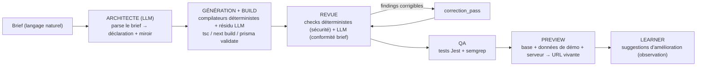
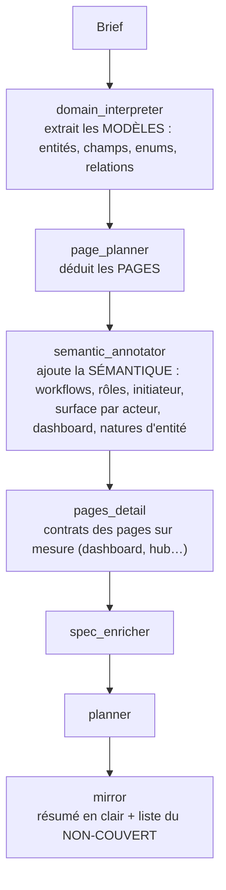
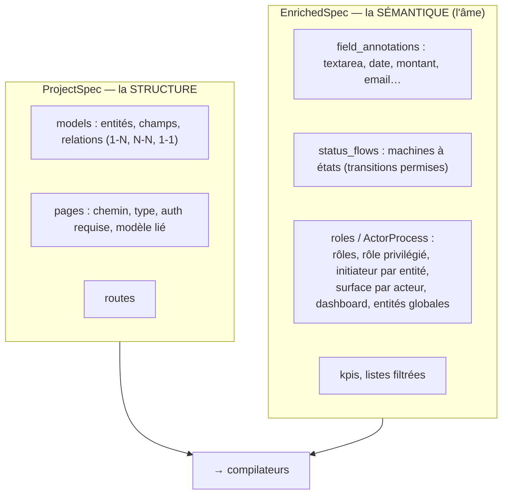
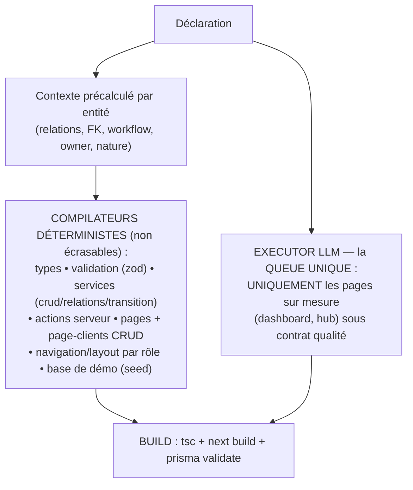
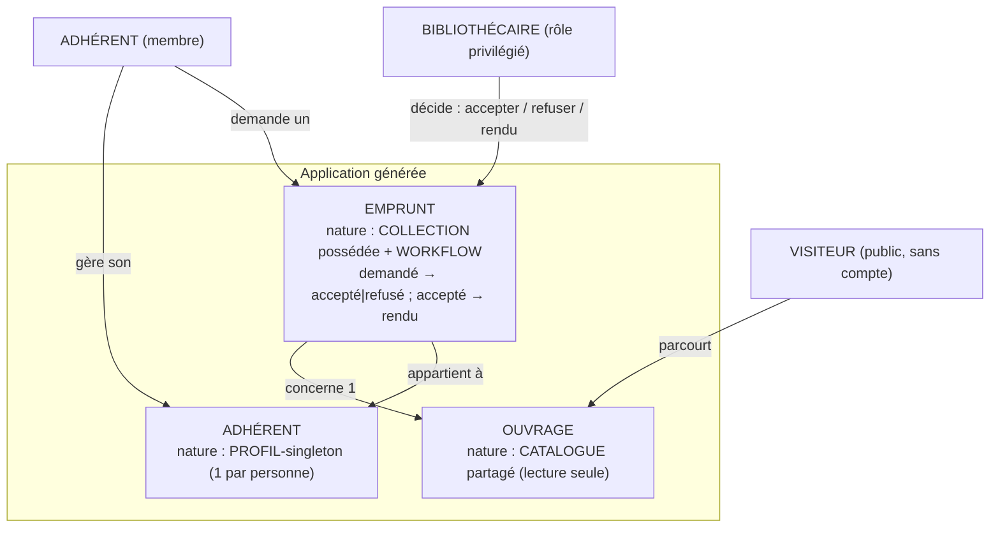

# Briefing pour recherche externe — « L'usine à applications »

> **À l'IA de recherche :** tu n'as aucun contexte préalable sur ce projet. Ce document
> t'explique **ce que nous construisons**, **le concept de conception** sur lequel nous nous
> sommes arrêtés, **l'histoire** (dont des échecs), et **les problèmes** que nous rencontrons.
> Puis il te confie un **mandat de recherche** précis. Ta sortie attendue : un **cahier des
> charges** exploitable pour améliorer nos générateurs et notre « intelligence ».

---

## PARTIE I — Ce que nous construisons

Une **usine à applications** : un système qui transforme un **brief en langage naturel** (la
demande d'un client, ex. « je veux une app pour gérer ma médiathèque… ») en une **application
web complète, fonctionnelle et déployée**, **sans écrire de code à la main**.

Le but business : qu'une personne non-développeuse puisse **produire des apps de qualité
automatiquement**, en servir **beaucoup de clients**, et livrer à la fin une **URL**.

- **Stack cible actuelle** : Next.js 14 (App Router), Clerk (authentification), Prisma 7 +
  PostgreSQL, TypeScript strict, Tailwind. Mais le **concept** est censé être stack-agnostique.
- **Le pipeline** (orchestré par Temporal) : `brief → architecte → génération → build →
  revue → preview live (URL)`. Détail des étapes :
  1. **Architecte** (LLM) : lit le brief, en extrait une **spécification structurée**
     (modèles de données, pages, routes, rôles, workflows…) + un « miroir » (résumé en clair
     de ce que l'app fera + la liste de ce que le brief demandait sans que ça soit couvert).
  2. **Génération** (déterministe + un résidu LLM) : produit tous les fichiers de l'app.
  3. **Build** : `tsc` + `next build` + `prisma validate` (arbitres de compilabilité).
  4. **Revue** : checks déterministes (sécurité/ownership) + un LLM (conformité au brief).
  5. **Preview** : crée une base, sème des données de démo, lance le serveur → **URL vivante**.

---

## PARTIE II — Le concept de conception (le cœur, à bien comprendre)

Nous avons convergé vers un **modèle COMPILATEUR**, par opposition au modèle « agentique ».

```
Brief (langage naturel)
   │
   ▼
ARCHITECTE (LLM = PARSEUR)     ← l'intelligence est ICI : comprendre le brief
   │
   ▼
DÉCLARATION (l'« AST »)        ← une structure typée : modèles, champs, relations,
   │                             rôles, workflows, natures d'entités, etc.
   ▼
COMPILATEURS (déterministes)   ← le cœur : des générateurs qui ÉMETTENT le code
   │                             (types, validation, services, pages, formulaires,
   │                             navigation, base de données de démo…)
   ▼
EXECUTOR LLM (la queue unique) ← seulement le code NON dérivable déterministiquement
   │                             (ex. une page dashboard « sur mesure ») sous contrat
   ▼
BUILD → app
```

**Devise : « intelligence aux bords, déterminisme au cœur. »**
- L'**intelligence** (LLM) sert à **comprendre** (parser le brief en déclaration) et à écrire
  la **queue irréductible** (le code unique à chaque app).
- Le **déterminisme** (compilateurs) émet tout le **récurrent** — de façon fiable, identique,
  vérifiable.

**Propriétés recherchées (et c'est là toute la valeur) :**
- **Reproductibilité** : deux briefs identiques → deux apps identiques.
- **Correction unique → parc entier** : on corrige **un compilateur une fois**, et **toutes**
  les apps du parc bénéficient de la correction en recompilant. (Un agent qui « ré-écrit » le
  code re-dérive tout à chaque fois et dérive ; un compilateur, non.)
- **Garanties déterministes** sur la couche critique (sécurité, ownership des données, types).
- **La déclaration est le produit** : le code est une sortie **jetable** ; ce qui a de la
  valeur, c'est la **déclaration** — le « négatif » depuis lequel on réémet.

**Une règle de décision importante que nous avons formulée — CLÔTURE vs DÉSIR :**
- **Clôture** = la mécanique **impliquée par nécessité** par ce que le brief demande, sans
  quoi la demande est **incohérente** (ex. : « le membre gère son profil » implique qu'un profil
  **existe**, provisionné automatiquement). → l'architecte **doit la compléter**.
- **Désir** = une fonctionnalité **non nécessaire** au fonctionnement de ce qui est demandé
  (ex. notifications e-mail non mentionnées). → l'architecte **ne devine pas** ; un « miroir »
  **remonte** le manque à l'humain, qui décide.
- Test : *le comportement demandé est-il incohérent sans ça ?* Oui→clôture, non→désir, doute→désir.

---

## SCHÉMAS — L'OSSATURE DE L'USINE

*(Diagrammes en Mermaid : rendus visuellement dans un lecteur compatible, et lisibles tels quels.)*

### 1. Le pipeline global (orchestré par Temporal)


### 2. L'architecte, décomposé (l'intelligence qui PARSE le brief)


### 3. La DÉCLARATION produite (l'« AST » — le vrai produit)


### 4. La couche de GÉNÉRATION (le cœur déterministe + la queue LLM)


### 5. Exemple concret — l'étalon « médiathèque » (les 3 natures d'entité)


---

## PARTIE III — L'histoire : comment on en est arrivés là (dont les échecs)

**1. Le pari agentique — et son échec sur le terrain.**
Au départ, l'approche « à la mode » : des **agents IA écrivent tout le code** de l'app,
librement. Ça a **échoué** de façon reproductible :
- **boucles** (l'agent tourne en rond sur une erreur TypeScript) ;
- **hallucinations** (invente des API, des champs, des imports) ;
- **fausse confiance** : le build ET la revue affichent « cohérent 100/100 » sur des apps en
  réalité **cassées** — le capteur ment ;
- **non-reproductibilité** : corriger un bug dans une app ne le corrige nulle part ailleurs ;
- **rayon de destruction** : un agent qui livre du code non revu peut casser les 50 clients.

**2. Le pivot vers le modèle compilateur.**
On a déplacé l'intelligence **aux bords** (comprendre + queue unique) et mis du **déterminisme
au cœur**. On a alors construit progressivement des « **types** » d'apps, par **expansion
structurelle** — chaque type = de nouvelles **cases** dans la déclaration + les compilateurs qui
les lisent :
- **CRUD de base** (list/create/detail/edit) — « Level A » ;
- **relations** (1-N, plusieurs-à-plusieurs, 1-1) ;
- **pages publiques / catalogue** (navigation sans connexion, SEO, slugs) ;
- **workflows / machines à états** (un statut qui progresse : demandé→accepté→…) ;
- **rôles / multi-acteur** (un admin voit tout et décide ; un membre voit les siens).
Chaque expansion a été **testée par des runs réels** et **validée** (build vert + code lu).

**3. La réalisation récente — « ça build » ≠ « app utilisable ».**
En testant **manuellement** (un humain utilise l'app dans le navigateur), on a découvert des
apps qui **compilent parfaitement** mais sont **« sans âme »** : incohérentes à l'usage. Exemples
réels (app de médiathèque : catalogue public + adhérents + emprunts + bibliothécaire) :
- le bibliothécaire (admin) pouvait **lui-même emprunter** (incohérent : il décide, il n'emprunte pas) ;
- la navigation était **identique** pour tous les rôles ;
- une page « profil » renvoyait « page introuvable » ;
- le tableau de bord affichait des **compteurs figés à 0** ;
- des **noms techniques en anglais** (« Borrowing ») fuyaient à l'écran ;
- un formulaire de création demandait de **choisir « soi-même »** dans une liste.

**Diagnostic :** la **structure** était compilée, mais la **logique vivante** ne l'était pas —
*qui fait quoi à qui, ce qui change, ce que chaque acteur voit*. Cette couche « sémantique /
opérationnelle » n'avait **aucune case** : l'intelligence de l'architecte la **comprenait** mais
la restituait en **prose** (« l'adhérent demande, le bibliothécaire décide ») — et **la prose
ne se compile pas**, elle s'évapore. C'est **exactement le même mécanisme** que nos succès
passés : une intention n'atterrit que si elle a une **déclaration typée + un compilateur**.

**4. Le cadre qu'on a posé en réponse (état actuel).**
On a formalisé une **« anatomie d'une app bien formée »** (universelle), dont les piliers :
- **La loi d'affordance honnête** : tout élément visible (lien, bouton, chiffre, action) est une
  **promesse** ; il n'existe **que si** l'acteur a la **capacité** ET la **donnée** existe.
- **Trois NATURES d'entité** (fini le CRUD uniforme) :
  - **profil-singleton** (une instance par personne : « mon profil », provisionné, pas de liste) ;
  - **catalogue partagé** (référentiel commun, souvent public, en **lecture seule** sauf
    gestionnaire déclaré) ;
  - **collection possédée ± workflow** (créée par un initiateur, décidée par un décideur).
- **Dashboard = hub différencié par rôle** (aperçu calculé + portes ; jamais un doublon d'une
  autre page ; celui du membre ≠ celui de l'admin).
- **Localisation partout** (aucun nom technique visible).

---

## PARTIE IV — Les problèmes où nous butons (le cœur du besoin)

1. **On stagne sur UNE classe d'apps** : les apps **profondes, multi-acteur, sémantiquement
   riches**. Les CRUD simples marchent ; dès qu'il y a des rôles, des processus, des natures
   d'entités variées, l'app générée devient **logiquement incohérente** à l'usage.

2. **On découvre les manques RÉACTIVEMENT** : c'est un **test humain** qui révèle une case
   manquante, au lieu de la **dériver à l'avance** d'un **modèle complet de « ce qu'est une
   app »**. On aimerait pouvoir dire *« ce type d'app a besoin de telle case »* **avant** de
   lancer un run. (Notre signal de « on a fini » : le **taux de découverte de nouvelles cases
   tombe à zéro** sur des briefs inédits.)

3. **La frontière déterministe / LLM** n'est pas cartographiée par **type d'app** : que faut-il
   compiler (récurrent, garanti) vs laisser à l'IA (queue unique) — et où est la limite selon le
   type d'app ?

4. **Nous manquons d'un référentiel externe** du **métier de conception d'apps** : les **types
   d'apps**, leur **nature**, leurs **composants**, ce qu'ils **nécessitent** — pour ne plus
   réinventer au coup par coup, mais **construire contre un modèle établi**.

---

## PARTIE V — MANDAT DE RECHERCHE (ta mission)

Objectif : produire un **cahier des charges** qui nous dise **quelles cases** (déclarations +
compilateurs, et où placer le résidu LLM) construire pour **couvrir la majorité des types d'apps
que nous visons**, **dérivé d'un modèle complet** plutôt que découvert par l'échec.

### MISSION 0 — Remets en question notre paradigme (prioritaire)

**Avant** de répondre à nos questions précises, prends du recul sur notre **choix de conception
fondamental**. Nous avons *convergé* vers le modèle compilateur — mais ce n'est **pas gravé dans
le marbre**, et nous préférons une **remise en question lucide** à une confirmation complaisante.
Évalue honnêtement, et n'hésite pas à **entrevoir une meilleure solution que nous n'aurions pas
envisagée** :
- Le **modèle compilateur** (intelligence aux bords / déterminisme au cœur, déclaration typée
  comme « AST », résidu LLM pour la queue) est-il le **bon paradigme** pour une usine à apps —
  ou existe-t-il une **architecture / une pensée meilleure** (autre découpage, autre place de
  l'IA, autre représentation intermédiaire, DSL, synthèse de programmes, approche hybride…) ?
- Nos **hypothèses** tiennent-elles ? (ex. : « la déclaration typée est le bon niveau
  d'abstraction » ; « corriger un compilateur → tout le parc » ; « on ne fait pas confiance à
  l'IA pour le cœur ».) Où se trompent-elles, ou pourraient-elles être dépassées ?
- Existe-t-il un **paradigme émergent** (recherche, industrie, outils no-code/AI, génération de
  programmes) qui résoudrait **mieux** notre problème de fond ?

**Verdict attendu :** si notre logique de conception s'avère **la meilleure** (ou proche),
**conserve et affine** les missions ci-dessous. Sinon, **propose le meilleur cadre** et
**ré-exprime nos missions dedans** (ne les supprime pas — traduis-les). Dis-nous clairement ce
que nous aurions **mieux fait de penser autrement**.

### Nos questions (dans le cadre actuel — à valider, affiner, ou reformuler selon Mission 0)

Recherche approfondie, sourcée (design produit, ingénierie logicielle, patterns SaaS), sur :

**A. Une TAXONOMIE des types d'applications** que vise ce genre d'usine (ex. : CRUD/SaaS de
gestion, outils internes, CMS/blog, marketplace, réservation/booking, tableaux de bord /
analytics, réseaux/communauté, e-commerce léger, gestion de projet, etc.).
- Pour chacun : sa **définition**, ses **caractéristiques distinctives**, ses **exemples**.

**B. Pour chaque type, son ANATOMIE :**
- les **acteurs** typiques et leurs **parcours** (ce qu'ils voient et font, écran par écran) ;
- les **entités** typiques et leur **nature** (profil, catalogue, collection, transactionnel,
  référentiel, pivot, agrégat…) — proposer/compléter une **taxonomie des natures d'entité** ;
- les **composants** (pages, formulaires, listes, détails, tableaux de bord, workflows,
  navigations, notifications…) ;
- ce que le type **nécessite** (authentification, rôles/permissions, machines à états,
  agrégations/temps, fichiers/médias, paiements, recherche, temps réel, e-mails…).

**C. Les PATTERNS UNIVERSELS transversaux** (qui traversent les types) : natures d'entité,
dashboard-hub, différenciation par rôle, complétude CRUD, affordance honnête, localisation,
provisionnement d'un profil, FK « de contexte » auto-remplies, ownership, etc. — les nommer,
les décrire, dire quand ils s'appliquent.

**D. Les RÈGLES DE DÉCISION** (heuristiques) pour classer, depuis un brief, chaque **entité**,
**acteur** et **flux** dans les bons patterns/natures. (Ex. : à quels signaux reconnaît-on un
« profil-singleton » vs une « collection » ? une entité « en lecture seule » ? une FK « à
choisir » vs « de contexte » ?)

**E. La FRONTIÈRE compilable / résiduel-LLM par type** : qu'est-ce qui est **récurrent et
garantissable déterministiquement** vs **unique et laissé à l'IA**, selon le type d'app.

**F. Les BONNES PRATIQUES / « anatomies de référence »** par type d'app (product & UX standards)
que l'on puisse **encoder en règles de compilateur** (pas des inspirations vagues : des règles).

**Format de sortie souhaité :** un cahier des charges structuré — taxonomie + fiches par type
(acteurs / entités+natures / composants / besoins) + catalogue de patterns universels + règles
de décision + recommandations de frontière déterministe-vs-LLM. Priorise ce qui nous fait
**dériver les cases à l'avance** au lieu de les découvrir par l'échec.

---

*Contexte fourni par l'équipe de l'usine. La médiathèque (catalogue public + adhérents + emprunts
à workflow + bibliothécaire décideur) sert d'étalon concret ; mais la recherche doit viser le
**général** — le modèle des types d'apps, pas ce cas particulier.*
