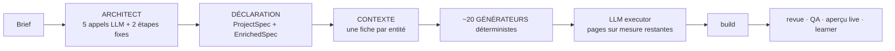
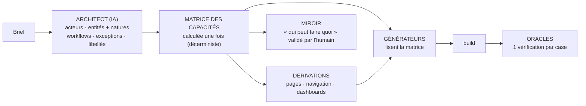

# USINE — documentation centrale

> **Document de référence unique du projet.** Il remplace la dispersion des anciennes docs
> (voir §9). En cas de contradiction avec un autre fichier, **ce document fait foi**.
> Détail du code actuel, fichier par fichier : dossier [`lecture_usine/`](lecture_usine/).
>
> Créé le 30 septembre 2026, après la reprise du projet et la lecture complète du code.
> Mis à jour à chaque décision (journal en §8). Les sections marquées « proposé » sont en
> discussion ; seules celles marquées « ✔ validé » et le journal engagent.

---

## 1. Ce qu'on construit

Une **usine à applications web** : elle transforme un brief écrit en langage courant en une
application complète, sécurisée et fidèle à la demande, **avec très peu d'IA consommée**.

- **Objectif** : un produit commercialisable (pas un portfolio, pas un projet d'apprentissage).
- **Désir d'origine** : faire travailler des agents IA sur une tâche que beaucoup de gens
  paieraient pour ne plus faire eux-mêmes. Le développement d'apps en est l'application choisie.
- **Avantage visé** : là où un agent de code réécrit tout à chaque fois (coûteux, variable,
  failles fréquentes), l'usine **compile** : l'IA ne fait que comprendre ; le reste est produit
  par du code déterministe, reproductible, vérifiable et presque gratuit à exécuter.
- **Stack actuelle des apps générées** : Next.js 15 + React 19 + Clerk (authentification) +
  Prisma 7 + PostgreSQL + Tailwind/shadcn.

---

## 2. Principes (acquis, confirmés par les runs)

1. **Loi du contenant.** Une intention du brief sans structure typée pour la porter s'évapore,
   même si l'IA l'a parfaitement comprise. Étendre l'usine = créer des cases, pas enseigner à l'IA.
2. **Intelligence aux bords, déterminisme au cœur.** L'IA comprend le brief et écrit la queue
   vraiment unique ; tout ce qui revient est compilé.
3. **Une seule source par concept.** Un fait (« qui possède cette donnée », « quelles méthodes
   existent ») est calculé à un seul endroit ; tout le reste en dérive. Toute copie finit par
   diverger (preuves : `getPublished` en juillet, les deux pannes du 28 septembre).
4. **L'app est des acteurs qui déroulent un processus sur des entités.** Pas « des entités et
   des écrans ». L'unité de conception est l'acteur, pas l'entité.
5. **Affordance honnête.** Un bouton, un lien, un chiffre n'existe que si l'acteur a la capacité
   ET que la donnée existe. Sinon il n'apparaît pas.
6. **Clôture vs désir.** L'usine complète ce qui est impliqué par nécessité (clôture) ; elle ne
   devine jamais ce qui n'est pas demandé (désir) : le miroir le remonte à l'humain. Dans le doute,
   c'est un désir.
7. **La déclaration est le produit.** Le code généré est jetable ; on corrige la déclaration ou le
   compilateur, jamais le code livré. Corriger un compilateur une fois corrige tout le parc.
8. **Des juges qui ne mentent pas.** Le build juge la forme ; les oracles (tests dérivés de la
   déclaration, joués sur l'app qui tourne) jugent le comportement ; le miroir + l'humain jugent
   l'intention. Un score calculé par un LLM n'est pas une preuve.

---

## 3. L'usine aujourd'hui (état au 30 sept 2026)

### 3.1 Le flux



Orchestration Temporal (`workflows/todo_pilot_workflow.py`), environ 23 000 lignes.
Lancer un run : `docker exec factory-worker python scripts/run_batch.py --briefs scripts/<fichier>.json`.

| Étape | Rôle | Détail |
|---|---|---|
| Architect | brief → déclaration (+ miroir) | [lecture_usine/02](lecture_usine/02_architect.md) |
| Contexte | une fiche calculée par entité | [lecture_usine/03](lecture_usine/03_contexte_et_contrats.md) |
| Générateurs données | types, validation, services, actions, seed | [lecture_usine/04](lecture_usine/04_generateurs_donnees.md) |
| Générateurs interface | pages, écrans, navigation, dashboard, design | [lecture_usine/05](lecture_usine/05_generateurs_interface.md) |
| LLM executor | pages sur mesure, boucle de build | [lecture_usine/06](lecture_usine/06_llm_executor.md) |
| Juges | build, revue, QA, qualité | [lecture_usine/07](lecture_usine/07_controle_qualite.md) |
| Learner, rapports | suggestions, FactoryRunReport | [lecture_usine/08](lecture_usine/08_learner_et_rapports.md) |
| Config, infra | stack JSON, templates, Docker | [lecture_usine/09](lecture_usine/09_config_et_infra.md) |

### 3.2 Ce qui est acquis
- Types d'apps couverts : CRUD privé, publication publique (slug, SEO, tags), workflows
  (machine à états avec garde des transitions et verrous), rôles (un rôle privilégié qui voit et
  décide tout), premières briques d'« âme » (qui initie, navigation filtrée par acteur).
- Pièces solides : protection des fichiers générés, garde pré-build, source unique des méthodes de
  service (`methods_for`), indicateurs de dashboard compilés en calculs exacts, Design Compiler
  (vocabulaire fermé), miroir (`summary_fr` + `unsupported`), aperçu live automatique, seed.

### 3.3 Ce qui ne va pas (causes structurelles, vérifiées dans le code)
1. **Mauvais ordre** : l'architect planifie les écrans avant de déclarer les acteurs.
2. **Mauvaise unité** : tout est généré « par entité × type de page ». Les notions d'acteur sont
   des réglages isolés relus dans 9 fichiers ; les gabarits d'écrans et le dashboard n'en lisent
   aucun (boutons montrés à tous, dashboard identique, navigation limitée à 2 acteurs).
3. **Concepts recopiés** (propriétaire, visibilité, nommage, clés étrangères) → divergences.
4. **Modèles transportés en texte** reparsé par des expressions régulières différentes.
5. **Garde-fous symptomatiques** qui corrigent un LLM planificateur de pages.
6. ~~**Code vestigial**~~ — traité en phase 2 (≈ 10 000 lignes, dont une partie en attente de
   suppression par l'humain, voir §6).
7. **Juges faibles** : un seul juge fiable (le build) ; l'oracle existe mais n'est jamais appelé ;
   le learner ne fait pas la mission qu'on lui a donnée.
8. ~~**La déclaration n'est pas conservée**~~ — corrigé le 30 sept (phase 1) : conservée dans
   `logs/declarations/`, rejouable par le harnais.

Mesure réelle (28 sept) : 2 briefs inédits de complexité normale → 0 build réussi sur 2, alors que
l'IA avait correctement compris rôles, workflow et dashboards les deux fois. Les pannes venaient du
cœur déterministe.

---

## 4. L'usine cible

### 4.1 Le flux cible



Ce qui change : l'IA ne planifie plus les écrans ; elle déclare qui existe, ce qui existe et
comment ça évolue. Tout le reste se **déduit**.

### 4.2 Les 9 axes (le vocabulaire de détection)

Toute phrase d'un brief répond à l'une de ces questions. Si elle tombe sur un axe où l'usine n'a
pas de case, c'est un « non couvert » détecté avant de construire.

| # | Axe | Question | Couverture actuelle |
|---|---|---|---|
| 1 | Acteurs | Qui ? | solide |
| 2 | Entités + natures | Quoi, de quelle nature ? | mince (pas de profil) |
| 3 | Permissions & conditions | Qui peut faire quoi, sous quelle condition ? | solide pour 2 acteurs |
| 4 | États | Comment ça évolue ? | solide |
| 5 | Agrégats | Qu'est-ce qu'on calcule ? | mince (pas de fenêtre de temps) |
| 6 | Navigation | Qui voit quoi, où ? | mince (pas de dashboard par acteur) |
| 7 | Libellés | Comment on le dit ? | mince (fuites de noms techniques) |
| 8 | Effets externes | Qu'est-ce qui sort (e-mail, SMS, paiement) ? | absent |
| 9 | Temporel | Qu'est-ce qui arrive seul avec le temps ? | absent |

Les axes disent **quoi capturer**. La matrice est **le moteur** où convergent les axes 1, 2, 3, 6
(et 5 pour les dashboards).

### 4.3 La matrice des capacités

**Entrée** (produite par l'architect, validée par Pydantic) :

```yaml
actors:
  - { id: client, label: "Client" }
  - { id: patron, label: "Patron", privileged: true }
  # le visiteur (non connecté) existe toujours, implicitement
entities:
  - { name: Vehicle, nature: collection, owner: client }
  - { name: Repair,  nature: collection, owner: client,
      workflow: { initial: pending, transitions: {...}, decider: patron,
                  captured_on: { rejected: [rejectionReason], completed: [amount] } } }
  - { name: Workshop, nature: catalog, manager: null, public: true }
  - { name: ClientProfile, nature: profile, actor: client }
exceptions:   # seulement ce que le brief dit explicitement et qui s'écarte des préréglages
  - { actor: client, entity: Repair, action: cancel, while: [pending] }
```

**Les natures sont des préréglages** de la matrice :

| Nature | Propriétaire / acteur concerné | Autres acteurs | Visiteur |
|---|---|---|---|
| **profil** (un par personne) | voit et modifie SA fiche ; créée automatiquement ; pas de liste | ne voient rien ; la voient dans la fiche de ce qu'ils traitent (« voir au travers de ») | rien |
| **catalogue** (référentiel partagé) | — | voient tout (seulement le publié si `publication`) ; le ou les gestionnaires déclarés créent et modifient ; sinon lecture seule | voit tout (ou le publié) si `public` |
| **collection** (sans workflow) | voit les siennes, crée, modifie | rien, sauf exception citée ; si `public` : tous voient tout | rien (sauf `public`) |
| **collection saisie pour autrui** (`entered_by`) | suit les siennes, ne crée pas | celui qui saisit voit tout, crée, modifie, et voit la liste des propriétaires pour choisir | rien |
| **collection + workflow** | voit les siennes, crée (initiateur) ; **ne modifie pas** sauf exception citée (ex. « tant qu'en brouillon ») ; un « acte » (commande, inscription) = workflow à un état | le décideur voit tout et fait avancer l'état ; ne crée pas ; des étapes peuvent être confiées à un autre acteur (`steps_by`) | rien |
| **enfant** (lié à un parent) | même visibilité que le parent ; géré par qui peut **modifier** le parent | idem | **rien** sauf si l'enfant est déclaré public |

**Supprimer n'est accordé par défaut à personne**, quelle que soit la nature : il faut « gérer » ou
« supprimer » dans le brief (exception citée). *(Règles validées sur le banc de 12 briefs, 1er oct.)*

**Sortie** : une cellule par (acteur, entité) :
`voir ∈ {rien, les siennes, tout, publiés}` · `créer ∈ {non, oui, auto}` ·
`modifier (champs, états)` · `supprimer (états)` · `transitions permises`.

Règles de clôture calculées (jamais demandées à l'IA) : profil créé automatiquement ; clé
étrangère vers le profil de l'acteur remplie automatiquement (jamais un choix « soi-même ») ;
écran de décision atteignable par le décideur. *(Corrigé le 1er oct : la règle « le décideur
n'est pas l'initiateur » était fausse en général — dans un tableau de tâches, le propriétaire fait
avancer ses propres tâches. Le décideur peut donc être le propriétaire lui-même.)*

**Parades aux deux risques de la matrice** *(proposé le 30 sept)* :

1. **Préréglages au moindre privilège** (« refuser par défaut », principe de sécurité standard).
   Un acteur ne reçoit par défaut que ce que son rôle dans le processus rend nécessaire (le
   décideur voit ce qu'il décide et ce que ces éléments référencent ; le gestionnaire gère son
   catalogue) ; tout accès aux données d'autrui au-delà exige une phrase du brief. Effet : une
   exception oubliée donne un **manque visible** (« la secrétaire ne voit pas X »), corrigeable
   en modifiant la déclaration et en régénérant, au lieu d'une **fuite invisible**.
2. **Chaque décision non triviale cite le brief.** L'architect joint à chaque acteur, nature et
   exception la phrase du brief qui la justifie ; le code vérifie que la citation existe
   mot pour mot dans le brief (pas d'invention). Sans citation = choix par défaut, candidat à
   une question du miroir.
3. **Chemins d'entrée des acteurs** (règle de clôture : chaque acteur en a exactement un) :
   | Acteur | Comment on le devient |
   |---|---|
   | public (le client, le patient…) | s'inscrit seul |
   | propriétaire du métier (privilégié) | amorçage par e-mail (`ADMIN_EMAILS`, existe) |
   | personnel interne (mécanicien, secrétaire…) | **invité par le privilégié** depuis une page « Équipe » dérivée |

   Mécanisme : `createInvitation({ emailAddress, publicMetadata: { role } })` de Clerk — le rôle
   est recopié sur l'utilisateur à l'inscription, et `getCurrentRole()` lit déjà
   `publicMetadata.role`. Limites connues : 100 invitations/heure ; la variante « en masse » ne
   recopie pas le rôle (bug Clerk #7956, contournement par le webhook `user.created`). À valider
   par un essai réel. Hors D1 : deux acteurs publics qui s'inscrivent seuls (marketplace).

### 4.4 Ce qui se déduit de la matrice

| Dérivé | Règle |
|---|---|
| **Pages** | pour chaque entité où « voir » n'est pas vide : liste + fiche (profil → une seule page « Mon … ») ; « créer » → page de création ; « modifier » → page d'édition ; transitions → bloc de décision sur la fiche ; ligne du visiteur → pages publiques. URL déterministes. |
| **Navigation** | par acteur : les entités où « voir » n'est pas vide, pour N acteurs. |
| **Dashboard** | par acteur : « à traiter » (éléments dans un état où il peut agir) ; « mes … en cours » (ses éléments pas terminés) ; indicateurs déclarés ; portes vers ses zones. |
| **Services** | filtre de propriétaire issu de « voir » ; une méthode n'existe que si une case en a besoin. |
| **Actions serveur** | une garde de rôle par case (refus côté serveur). |
| **Écrans** | chaque bouton rendu seulement si la case l'autorise pour l'acteur courant (capacités calculées côté serveur et passées à l'écran). |
| **Seed** | des données pour chaque acteur propriétaire ; catalogue sans propriétaire ; un profil par acteur. |
| **Oracles** | une vérification par case (« le client tente d'accepter → refusé ») et par état pour les cases conditionnelles. |
| **Miroir** | la matrice rendue en phrases, montrée à l'humain avant de construire. |

### 4.5 Grandir sans exploser : les dimensions

Toute demande exprimable dans le vocabulaire de la matrice est une **donnée**, pas du code. Le
code ne grandit que quand on ajoute une **dimension**, écrite une fois dans le calcul de la
matrice puis une fois dans chaque consommateur via des fonctions partagées.

| Dimension | Ajoute | Débloque |
|---|---|---|
| **D1** (maintenant) | matrice fixe + natures + workflow + visiteur | l'équivalent des anciens types A, D, I, K et l'âme de base |
| **D2** | conditions : selon l'état, selon une relation (« le manager voit SON équipe ») | écoles, cliniques, équipes |
| **D3** | agrégats avec fenêtre de temps et groupement | vrais tableaux de bord |
| **D4** | effets : « sur telle transition → e-mail / SMS / webhook / paiement » (connecteurs) | notifications, paiement |
| **D5** | temporel : « quand la date passe → rappel, expiration » | rappels, échéances |

Hors périmètre de la matrice (reste au LLM executor) : présentation riche (graphiques,
calendriers, mise en page sur mesure), calculs métier complexes.

**Ce que deviennent les anciens types** (ils ne disparaissent pas, ils se décomposent) :

| Type | En réalité | Où ça tombe |
|---|---|---|
| A, D, I, K | 1-N acteurs, visiteur, publication, workflow | matrice D1 |
| H | agrégats + graphiques | D3 + blocs d'affichage |
| G | temps + conflits de créneaux + calendrier | D5 + une règle métier + un bloc |
| E | paiement + commande atomique | D4 (connecteur) + transaction |
| J | stockage de fichiers | nouveau type de champ + connecteur |
| B | propriétaire = organisation | nouvelle dimension (la plus lourde) |

Les briefs existants restent : ils deviennent les étalons du harnais, choisis **par forme de
matrice** (1/2/3 acteurs, chaque nature, avec/sans workflow, avec/sans visiteur, avec exception)
plutôt que par type — les vrais briefs mélangent tout (le garage = K + I + catalogue + profil).
*(Proposé le 30 sept.)*

### 4.6 Circulation de l'information (✔ validé le 30 sept)

Modèle des compilateurs : **les étapes ne se parlent pas ; chacune lit une fiche et en produit
une autre, de forme fixe.**

```
Brief (texte)
 → Fiche 1  DÉCLARATION        écrite par l'IA, forme fermée, conservée : c'est le produit
 → Fiche 2  MATRICE + dérivés  calculée, figée
 → Fiche 3  PLAN DE FICHIERS   calculé : pour chaque fichier, qui le produit, avec quelles données
 → Fiche 4  CODE               fichiers produits, protégés
 → Fiche 5  VERDICTS           build, puis oracles case par case
```

Les 7 règles :
1. **Un fait = un seul auteur.** Calculé une fois, lu par tous (généralisation de `methods_for`).
2. **Entre machines, des données, jamais du texte.** La prose sert vers l'humain ; même le texte
   envoyé à l'IA est fabriqué à partir de données.
3. **Contrôle strict à chaque frontière.** Fiche invalide refusée à l'entrée ; si elle vient de
   l'IA, l'erreur précise lui est renvoyée (N essais), puis « non couvert ». Jamais « raw conservé ».
4. **Fiches figées.** Aucune étape aval ne corrige une fiche amont en silence ; une correction
   nécessaire devient une règle visible du calcul.
5. **L'IA reçoit le minimum, sous forme de données.**
6. **Les ordres d'exécution viennent du plan (fiche 3), pas des agents.** Temporal l'exécute.
7. **Traçabilité.** Chaque fichier généré sait de quelle case il vient.

Fuites actuelles que ces règles ferment (vérifiées le 30 sept) : dictionnaire libre et modèles en
texte dans l'architect ; `EnrichedSpec` invalide conservé (`architect.py:458-464`) puis erreur deux
étapes plus loin (`dev_graph.py:323`) ; 8 représentations de l'app transportées vers la génération
qui ne lit que `project_spec` ; corrections silencieuses aval (spec_enricher, planner) ; générateurs
qui recalculent propriétaire/global ; prose vers l'executor ; déclaration effacée.

Limite assumée : la règle 3 bloque une fiche **mal formée**, pas une fiche **fausse** (ex. une
entité classée « collection » au lieu de « catalogue »). Seul le miroir validé par un humain
l'attrape → la validation humaine est une pièce obligatoire, pas un confort.

### 4.7 Place de l'IA (direction proposée le 30 sept)

| Rôle de l'IA | Statut |
|---|---|
| **Architect** : écrire la fiche 1 (acteurs, natures, processus, exceptions) | le cœur agentique ; réordonné en phase 4 |
| **Libellés** | garder |
| **Miroir** : détecter ce que le brief demande et que la déclaration ne porte pas | garder |
| **Design brief** : choix dans un vocabulaire fermé | garder (bon patron) |
| **Écriture de code** (executor) | **en attente** : ni retiré ni développé avant la phase 5 |

Refonte de l'executor après la phase 5 (elle dépend de la matrice, qui fournit les données typées) :
1. **Réduire l'unique** : chaque forme récurrente (calendrier, graphique, kanban, frise…) devient
   un bloc compilé que l'IA choisit et règle dans un vocabulaire fermé.
2. **Une zone, pas une page** : la page (données, gardes, navigation) est générée ; l'IA remplit un
   composant d'affichage qui reçoit des données déjà filtrées par la matrice, typées, sans accès
   à Prisma ni à l'authentification → elle ne peut pas faire fuir une donnée.
3. **Un échec ne casse rien** : après N échecs, affichage générique + « zone non personnalisée ».

### 4.8 Le miroir cible (proposé le 30 sept)

Aujourd'hui : un LLM résume la déclaration ; le workflow **n'attend pas** ; le résultat ne va que
dans le rapport final (`todo_pilot_workflow.py:534`) → on lit « ce que l'app va faire » quand elle
est déjà construite.

Cible — le miroir est une **vue** de la déclaration, jamais une source (règle 1) :
1. **Porte avant construction** : le workflow s'arrête après l'architect et attend la validation.
2. **Interface de correction** : on corrige la déclaration (jamais le code ni le brief), puis tout
   est recalculé et le miroir réaffiché.
3. **Contrat vérifié** : chaque phrase vient d'une case, chaque case a son oracle → « phrase
   validée → vérifiée sur l'app ✅/❌ ».
4. **Interface d'évolution** : plus tard, le client modifie son miroir → diff de déclaration →
   régénération (la maintenance comme service).
5. **Détection des manques** (`unsupported`) → learner.

Les phrases « qui peut faire quoi » sont produites **par du code à partir de la matrice**, pas par
un LLM (le miroir ne peut plus mentir sur ce qui sera construit). Le LLM garde seulement la
comparaison brief ↔ déclaration.

**Des questions ciblées, pas un mur de texte.** Une longue liste de phrases est approuvée sans
être lue. Le miroir met donc en avant 3 à 5 questions oui/non, seulement là où une erreur coûte :
un acteur qui accède aux données d'un autre, et tout choix par défaut sans citation du brief
(« La secrétaire doit-elle voir le contenu des consultations ? »). Chaque réponse modifie la
déclaration de façon déterministe (ajout / retrait d'une exception), sans IA.

---

## 5. Les juges (cible)

| Juge | Juge quoi | Statut cible |
|---|---|---|
| `next build` / `tsc` / `prisma validate` | la forme | garder |
| Garde pré-build | cohérence des fichiers générés | garder |
| **Harnais** | le cœur déterministe sur toutes les formes de matrice, sans IA | en place (9 étalons, `scripts/harness.py`) |
| **Oracles** | le comportement réel, case par case, sur l'app qui tourne | à généraliser et brancher (phase 5) |
| **Miroir + humain** | l'intention | garder, enrichir avec la matrice |
| Reviewer L1 (auth, PII) | failles sur les pages écrites par le LLM | garder |
| Reviewer L2 (gpt-4o) | « conformité » | **retiré** (30 sept) |
| QA Jest (gpt-4o) | tests de code déterministe | **retiré** (30 sept) ; Semgrep gardé |
| spec_coverage, journey_validator | existence de fichiers | retrait proposé (remplacés par oracles) |
| Learner | — | devient l'agrégateur des « non couverts » par axe (phase 6) |
| Coût réel en $ par run | l'avantage économique | à mesurer (à ajouter au rapport) |

---

## 6. Plan

Chaque phase a un critère de « terminé » vérifiable. On ne passe pas à la suivante sans lui.

### Phase 0 — Documentation centrale ✔ (30 sept 2026)
Ce document + [`lecture_usine/`](lecture_usine/).

### Phase 1 — Harnais (filet de sécurité) ✔ (30 sept 2026)

**Réalisé :**
- `agents/declaration_store.py` : l'architect conserve chaque déclaration (brief + ProjectSpec
  complet, miroir compris) dans `logs/declarations/<projet>/<horodatage>.json`.
- `agents/stacks/nextjs_clerk_prisma/dev_core.py` : la séquence des générateurs
  (`generate_core`) et les commandes de préparation (`run_pre_run_commands`), déplacées telles
  quelles depuis `dev_graph.py` (1 634 → 1 242 lignes). Le pipeline ET le harnais appellent ces
  fonctions : une seule définition.
- `scripts/capture_declarations.py` : lance l'architect seul sur des briefs →
  `harness/declarations/<projet>.json` (9 étalons capturés : abo-tracker, atelier-partage,
  atelier-recettes, club-running, coworking-hub, garage-atlas, it-requests, médiathèque, notes-frais).
- `scripts/harness.py` : rejoue, compare à `harness/references/<projet>/`, vérifie `tsc`.
  Commande : `docker exec factory-worker python scripts/harness.py` (≈ 2 min 45 pour 9 apps, 0 IA).
- Vérifié : un run complet médiathèque après l'extraction → BUILD_SUCCESS du premier coup,
  déclaration conservée ; trois passages consécutifs du harnais → fichiers identiques.

**Ce que le harnais a déjà montré (30 sept) :**
1. **atelier-partage : 10 erreurs `tsc`**, la panne du 28 sept reproduite sans IA en 47 s
   (`relations.py` filtre par `userId` des entités globales ; relation à 2 niveaux). À traiter par
   la matrice (phase 5), pas par un correctif isolé.
2. **Générateur non déterministe** : `dev_seed_generator._topo_order` parcourait un `set` →
   ordre de `seed.mjs` différent à chaque processus. Corrigé (ordre de la déclaration) : sans ça,
   le harnais signalait des différences fantômes.
3. **Alerte « owner_field absent »** sur chaque catalogue global (Book, Space, Workshop, Domain).
   Corrigé en phase 2 : elle n'est pas fausse — vraie pour `relations.py`, fausse pour `crud.py`
   → symptôme de la notion de propriétaire calculée à deux endroits (phase 5).
4. **Seed faux** (atelier-partage) : `slot.create({ workshopId: OWNER })` — la clé étrangère vers
   un catalogue global reçoit l'identifiant de l'utilisateur. Le seed est hors build, donc
   invisible au build, mais les données de l'aperçu échoueraient (phase 5, seed lu depuis la matrice).
5. **Variance de l'architect** : la nouvelle déclaration du garage compile (`tsc` OK), celle du
   28 sept ne compilait pas ; elle n'avait pas été conservée, donc cette panne-là n'est pas dans les
   étalons. C'est exactement la raison de conserver chaque déclaration désormais.

**Limites du harnais** : `tsc` juge les types, pas tout ce que vérifie `next build` ; ne couvre
pas ce qui dépend d'un LLM (design brief, page-clients décorés, pages de l'executor).

Constat de départ (vérifié le 30 sept) : **la déclaration n'était conservée nulle part**.
L'architect écrit `project_spec_<projet>.json` à la racine de `FACTORY_WORKDIR`, puis
`dev_graph` supprime au démarrage tous les `.json` de cette racine (il les prend pour des résidus).
C'est contraire au principe 7 (« la déclaration est le produit »).
1. **Conserver la déclaration** complète (ProjectSpec + enriched_spec + miroir) dans un dossier
   dédié, persistant et visible depuis l'hôte (ex. `logs/declarations/<projet>.json`, déjà monté).
2. **Récupérer les étalons** : relancer l'architect seul sur les briefs existants (quelques appels
   LLM par brief) — médiathèque, notes-frais, it-requests, coworking, atelier-recettes,
   abo-tracker, garage-atlas, atelier-partage.
3. **Étendre `scripts/test_generators.py`** (il existe, mais lit des briefs simplifiés sans
   enriched_spec) : charger la déclaration complète, appeler les générateurs dans l'ordre de
   `dev_graph` (sans IA, sans Temporal), lancer `tsc`, enregistrer les fichiers produits comme
   **référence**.
- **Terminé quand** : une seule commande rejoue toutes les références, donne le statut `tsc` de
  chacune et le diff des fichiers générés par rapport à la référence.
- Faits vérifiés (30 sept) : les briefs des 8 étalons existent en fichiers dans `scripts/`
  (médiathèque `test_full_pipeline.json`, notes-frais `test_type_i.json`, it-requests
  `test_typek.json`, coworking `test_lourd.json`, atelier-recettes et abo-tracker
  `test_expansion_d.json`, garage et atelier-partage `test_*_live_run.json`), plus une trentaine
  d'autres (dont `kpi_briefs.json`, 10 briefs) pour compléter la grille.
- Point pratique : `tsc` a besoin des dépendances installées. Le `package.json` des apps étant un
  gabarit fixe, une seule installation partagée sert à toutes ; compter de l'ordre d'une minute
  par app (estimation), sans IA.

### Phase 2 — Nettoyage ✔ (30 sept 2026 — suppression de fichiers en attente, voir fin)

**Réalisé** (chaque lot vérifié : harnais identique sur les 9 étalons, `tsc` inchangé, tests
pytest inchangés, noms indéfinis contrôlés ; puis un run complet médiathèque → BUILD_SUCCESS du
premier coup en **3 min 56 au lieu de 6 min 39**) :
- **Code mort débranché** : prebuild_pipeline, page_composer, navigation_generator, API Flask
  cassée (+ son lancement dans `start.sh`, le service n8n et le port 5000 dans docker-compose).
- **Learner** : analyses « superviseurs » (P008) et « batchs » (BP001-003) + import `sprint5_gate`
  retirés (−290 lignes) ; P001-P007 et le rapport de run gardés jusqu'à la phase 6.
- **Planificateur de l'executor** : plus de planification de services/actions (toujours générés en
  amont) → plus de repli silencieux vers l'IA si un générateur saute un fichier.
- **Juges IA retirés** : revue L2 gpt-4o (la revue ne garde que les contrôles déterministes auth +
  données personnelles) ; tests Jest écrits par gpt-4o (la QA garde Semgrep, qui ne tournait
  d'ailleurs que si des tests Jest avaient été générés — corrigé).
- **RAG Qdrant retiré** : prompt système et contexte par fichier de l'executor, standards de la
  revue, outil `rag_search`, config, `start.sh`, service Qdrant et dépendances.
- **Recherche web** retirée des outils de l'executor.
- **`shared_tools.py`** : 7 outils de l'ancienne architecture retirés (800 → 80 lignes).
- **Config de stack** : 47 → 18 clés (sections jamais lues, dont `_UNUSED_*` déjà marquées) ;
  schéma de validation mis à jour (il *exigeait* 4 clés que personne ne lisait) ; 12 fonctions de
  lecture de config orphelines retirées.
- **Nommage** : 6 copies de camelCase/kebab/pluriel remplacées par `dev_naming` (la copie de
  pluriel de `dev_pages_generator` était en plus inutilisée).
- **Retry « régénération complète avec feedback tsc »** retiré : dans l'historique, 27
  déclenchements pour 1 seul build sauvé, chaque fois la durée du run doublée.

**Écarté après vérification** (pas du code mort) :
- La double génération des page-clients : la 2ᵉ applique le design brief (IA) ; la 1ʳᵉ est le
  repli si le design brief échoue.
- La correction automatique par IA (`correction_pass`) : encore utilisée pour certains cas
  d'authentification.
- L'alerte « owner_field absent » : elle dit **vrai** pour `relations.py` (la panne
  d'atelier-partage) et faux pour `crud.py` → symptôme de la notion de propriétaire calculée à deux
  endroits ; se résout avec la matrice (phase 5), pas en la faisant taire.

**Mesure** (lignes non vides) : Python 30 978 → 29 055 aujourd'hui → **20 879 une fois les
fichiers ci-dessous supprimés (−33 %)** ; tout le code 34 205 → 23 671 (−31 %).

**En attente de l'humain** : la suppression de fichiers a été refusée à l'agent (action jugée
irréversible). Fichiers devenus inutilisés — plus aucun code actif ne les importe (vérifié) :
`agents/prebuild_pipeline.py`, `agents/stacks/nextjs_clerk_prisma/dev_page_composer.py`,
`agents/stacks/nextjs_clerk_prisma/dev_navigation_generator.py`, `api/`, `agents/rag_client.py`,
`agents/web_search.py`, `agents/embedding_provider.py`, `agents/qa.py`, `init_qdrant.py`,
`scripts/create_full_standards_v1.py`, `scripts/create_frontend_standards_v1.py`,
`scripts/enrich_qdrant.py`, `scripts/test_generators.py`, `scripts/fixtures/`,
`scripts/validate_config_consumption.py`, `prompts/base/reviewer.md`, `prompts/base/qa.md`,
`prompts/stacks/nextjs-clerk-prisma/rules_reviewer.md`, `schemas/prebuild_report.schema.json`.
Les conteneurs `qdrant` et `n8n` tournent encore (hors docker-compose désormais) : `docker stop`.

**Constats pour la suite** :
- 27 tests pytest échouent depuis des mois (ils visent `dev.py`, des flags T007, des « content
  guards »… d'anciennes architectures) : une suite rouge que tout le monde ignore est un juge qui
  ment → à trier.
- `agents/core/journey_validator.py` contient des noms indéfinis (`_path_of`, `_auth_of`) : bogue
  latent dans un juge déjà promis au retrait.

Candidats d'origine (conservés pour mémoire) :
`agents/prebuild_pipeline.py`, `dev_page_composer.py`, `dev_navigation_generator.py`,
`api/flask_api.py` (ou le réparer), la partie « superviseurs / batchs » du learner et l'import
`sprint5_gate`, la planification de services/actions dans `agents/planner.py`, la double génération
des écrans dans `dev_graph.py`, le retry tsc qui relance tout dans `dev_test_activity.py`, QA Jest,
les sections non lues de la config JSON, les réimplémentations du nommage (utiliser `dev_naming`).
Côté agentique (ajouté le 30 sept) : le **RAG Qdrant** (encore interrogé par le prompt système de
l'executor `dev_prompts.py:138`, son contexte par fichier `dev_context.py:72` et la revue L2
`review_activity.py:133` ; couper d'abord avec `DISABLE_RAG=1`, vérifier, puis supprimer Qdrant,
`create_full_standards_v1.py`, `enrich_qdrant.py`), la **recherche web** donnée à l'executor
(`dev_graph.py:882`), la **revue L2 gpt-4o** (un faux juge est pire qu'aucun juge ; garder L1), n8n.
Aussi : `scripts/test_generators.py` et `scripts/fixtures/` (remplacés par le harnais, qui appelle
la même fonction que le pipeline au lieu de recopier la séquence des générateurs) ; l'erreur
« owner_field absent » de `project_spec` sur les catalogues globaux (contredit `dev_model_context`).
Ces retraits ne changent pas la sortie déterministe → vérifiables par le harnais.
- **Terminé quand** : le harnais montre des fichiers générés identiques à la référence pour toutes
  les déclarations, et le nombre de lignes a baissé.

### En continu — dès le 1er oct 2026 (ajouté après remise en question du plan)
Le plan disait « construire selon la demande réelle » mais ne mesurait qu'en phase 6, et ne
parlait jamais de vrais utilisateurs. Deux corrections, en parallèle des phases :
1. **Compter les manques à chaque run** : `scripts/non_couverts.py` rassemble les « non couverts »
   du miroir (déclarations conservées + anciens rapports) en une liste unique,
   `logs/non_couverts.md`. Le classement par axe viendra avec le nouveau miroir (phase 4).
2. **Vrais briefs, tout de suite** (action humaine) : demander à 3-5 personnes réelles (artisans,
   associations, petites entreprises) de décrire en quelques lignes l'outil dont elles auraient
   besoin. Ces briefs deviennent des étalons — plus honnêtes que ceux que nous écrivons nous-mêmes.
   Message type :
   > « Je construis un outil qui crée des applications de gestion sur mesure. Si vous aviez une
   > appli pour votre activité, que devrait-elle faire ? Qui l'utiliserait (vous, vos clients, vos
   > employés…) et qui aurait le droit de faire quoi ? Quelques lignes suffisent, avec vos mots. »

### Phase 3 — La matrice (calcul seul, sans toucher aux générateurs) — en cours (1er oct 2026)

**Réalisé :**
- `agents/capability_matrix.py` (~500 lignes, 0 IA) : contrat d'entrée strict (un champ inconnu est
  refusé), préréglages, exceptions citées, clôture, dérivés (pages, menus, tableaux de bord par
  acteur), phrases du miroir produites par du code, questions ciblées. Chaque droit garde sa raison
  et ses citations.
- Banc `scripts/matrix_bench.py` : 12 briefs (9 étalons + 3 piégeux : marketplace de juillet,
  cabinet médical, association), entrée et matrice attendue écrites à la main dans
  `harness/matrices/`, l'attendu AVANT le calcul. **Résultat : 12/12 identiques ; 0,8 exception par
  brief ; 3 besoins hors D1 identifiés** (visibilité par relation ×2, choix du rôle à l'inscription).
  Médiathèque = matrice d'accès d'`anatomie_app.md`, menus et tableaux de bord compris.
- `scripts/non_couverts.py` et `scripts/matrix_ai_probe.py` (test de l'IA), `scripts/clerk_invite_spike.py`.

**Défauts de MA conception trouvés par le banc, puis corrigés** (aucun fichier attendu modifié pour
faire passer le code, sauf 4 révisions de doctrine signalées dans les fichiers) :
1. L'enfant d'une entité publique devenait public → participants (nom, e-mail) exposés aux
   visiteurs. Désormais un enfant n'est public que s'il est déclaré public.
2. L'enfant héritait des droits du *créateur* du parent → le membre aurait créé ses factures.
   Désormais seul qui peut *modifier* le parent gère ses enfants.
3. Pas de « publiés seulement » → brouillons visibles. Ajouté (`publication`).
4. Pas de « saisi pour le compte d'un autre » (le patron note le véhicule du client). Ajouté
   (`entered_by`, ou initiateur ≠ propriétaire).
5. Un seul acteur par processus → ajouté `steps_by` (l'employé soumet, le responsable décide).
6. La clôture « qui voit tout voit ce que ça référence » créait des pages non demandées (liste des
   adhérents) → remplacée par « voir au travers de » (affiché dans la fiche, sans page).
7. Supprimer était accordé par défaut → **supprimer n'est plus jamais accordé par défaut** (il faut
   « gérer » ou « supprimer » dans le brief) : un compte rendu médical ne se supprime pas d'office.
8. Un seul gestionnaire de catalogue → plusieurs possibles. Ajouts : collection publique (annonces,
   produits de vendeurs), alerte si deux acteurs s'inscrivent seuls.

**Test de l'IA (classification des entités, briefs du banc, exemples du prompt pris dans d'autres
domaines)** : matrices justes avec la classification de l'IA — **gpt-4o-mini 6/12, gpt-4o 8/12**.
- Sur les 4 échecs de gpt-4o, **3 portent sur des points réellement ambigus du brief** (qui crée les
  véhicules, qui peut annuler une réservation confirmée, qui gère les domaines) ; **1 vraie
  erreur** : brouillons de recettes rendus visibles → question systématique ajoutée au miroir sur
  ce que voient les visiteurs.
- La classification est **très sensible à la formulation** : un exemple mal choisi a fait tomber
  gpt-4o-mini à 2/12 (identifiants recopiés, valeurs d'exemple recopiées).
- Un bug de MON script (« false » en texte converti en vrai) aurait rendu publics des comptes rendus
  médicaux sans alerte : corrigé par une lecture stricte des booléens — la règle 3 vérifiée en vrai.

**Conséquences proposées pour la phase 4** : gpt-4o (pas mini) pour l'étape de classification
(quelques centimes par brief) ; les questions ciblées du miroir deviennent obligatoires et couvrent
les ambiguïtés (visiteurs, qui crée, qui fait chaque étape) ; essayer découpage en petites
questions et vote sur plusieurs tirages si le score ne monte pas.

**Reste pour fermer la phase 3** (humain) : l'essai réel de l'invitation Clerk (une adresse
e-mail et un clic) ; ta relecture de 2-3 matrices attendues (médiathèque, garage — lecture
ambiguë —, cabinet médical).

- Nouveau module `agents/capability_matrix.py` (indépendant de la stack : il ne dépend que de la
  déclaration) : modèle de données (§4.3), préréglages des natures, règles de clôture,
  dérivations (pages, navigation, dashboards), phrases du miroir.
- **Terminé quand** : la matrice calculée pour la médiathèque est exactement la matrice d'accès de
  l'étalon (anatomie, §9), et celles du garage et de l'atelier sont validées à la main.
- **Constat (30 sept)** : l'ancienne version du préréglage « collection + workflow » (l'initiateur
  modifie tant que l'état initial n'est pas quitté) contredisait la matrice de référence de la
  médiathèque (« éditer un emprunt : adhérent ❌ »). Corrigé en moindre privilège (tableau §4.3).
  Exactement le type d'erreur que la phase 3 doit attraper avant la phase 5.
- **Méthode** *(proposé le 30 sept)* : pour chaque étalon, l'entrée de la matrice et la matrice
  attendue sont écrites **à la main** à partir des phrases du brief (avec citations), la seconde
  AVANT de lancer le calcul. On teste ainsi le calcul et les préréglages seuls, sans l'IA. Ces
  entrées servent ensuite de vérité de référence en phase 4 : on mesurera si l'architect produit
  la même chose.
- **Porte de décision** *(proposé le 30 sept)* : avant la phase 4, écrire d'abord le contrat
  précis (table des préréglages, chemins d'entrée, citations), puis calculer la matrice « sur
  papier » pour tous les étalons **et** quelques briefs piégeux (cabinet médical, école,
  association). Mesurer : exceptions par brief, préréglages faux, accès trop larges. Si les
  préréglages ne tiennent pas, on les revoit ici, avant la partie coûteuse (phase 5).
  Faire aussi l'essai réel de l'invitation Clerk avec rôle.
- **Test de l'IA en fin de phase** *(ajouté le 1er oct)* : avant de figer le format d'entrée,
  demander à gpt-4o-mini de classer les entités (profil / catalogue / collection) et de désigner
  initiateur et décideur sur les briefs du banc ; comparer aux entrées écrites à la main. Quelques
  centimes. Si l'IA n'y arrive pas, on ajuste le format MAINTENANT plutôt qu'en phase 4.

### Phase 4 — L'architect dans le bon ordre
- Acteurs, entités + natures, workflows et exceptions déclarés **avant** tout le reste ; les pages
  ne sont plus planifiées par l'IA mais dérivées ; l'IA garde les libellés. Le miroir montre la
  matrice en phrases.
- **Terminé quand** : sur 3 briefs inédits, le miroir décrit correctement « qui peut faire quoi »
  et les pages dérivées couvrent le brief.

### Phase 5 — Les générateurs lisent la matrice
Un consommateur à la fois, harnais à chaque pas : services → actions → écrans (gabarits) →
navigation → dashboard → seed → oracles (+ appel de l'oracle après l'aperçu, score dans le rapport).
- **Terminé quand** : toutes les formes de matrice passent `tsc` et leurs oracles ; les 6 défauts
  documentés de la médiathèque ont disparu ; garage-atlas et atelier-partage buildent.

### Phase 5 bis — Premiers vrais utilisateurs *(ajouté le 1er oct)*
- Faire tourner l'usine sur les vrais briefs récoltés ; montrer le miroir puis l'app à leurs
  auteurs ; noter ce qui manque, ce qui est faux, ce qu'ils paieraient.
- **Terminé quand** : au moins 3 personnes réelles ont vu leur app et donné leur avis ; ce que
  nous apprenons modifie (ou confirme) l'ordre des dimensions D2-D5 et le positionnement (§7).

### Phase 6 — Learner utile
- Le comptage simple des « non couverts » existe déjà (voir « En continu »). La phase 6 ajoute le
  classement par axe, le coût réel ($) par run, et le branche dans le rapport de run.
- **Terminé quand** : le FactoryRunReport affiche score d'oracles, coût, et la liste des « non
  couverts » agrégée.

### Ensuite — dimensions D2 à D5
Même méthode pour chacune : contrat écrit d'abord, calcul dans la matrice, consommateurs, oracles,
harnais. Ordre décidé par la fréquence réelle des « non couverts » (phase 6), pas supposé.

---

## 7. Questions ouvertes

- **Positionnement business** : vendre des apps à des clients finaux, l'outil à des développeurs,
  ou autre — non tranché. L'usine cible sert les deux.
- **Autres stacks** : le code de génération est à ~100 % spécifique à Next.js/Clerk/Prisma ; le
  multi-stack attendra que la matrice soit stable.
- **Reviewer L2** : garder, réduire ou retirer, à décider après la phase 5.
- **Déploiement production** (domaine du client, base dédiée) et **stockage durable de la
  déclaration par client** : non construits ; nécessaires pour un service commercial.
- **Attribution des rôles dans l'app livrée** : aujourd'hui un seul rôle privilégié, attribué par
  une liste d'e-mails (`ADMIN_EMAILS`) ou à la main dans la console Clerk
  (`dev_actions_generator.py:40-70`) ; le code généré ne connaît que 2 acteurs. Piste proposée :
  chemins d'entrée + invitation Clerk avec rôle (§4.3) — à valider par un essai en phase 3.
- **Préréglages vs exceptions** : si la plupart des briefs demandent beaucoup d'exceptions, les
  préréglages sont mal choisis. Parades proposées : moindre privilège, citations, questions ciblées
  du miroir (§4.3, §4.8) ; mesure à la porte de décision de la phase 3.
- **Zones IA en première version ou pas** : décider après mesure de leur taux de réussite.
- **Originalité visuelle** : hors des préoccupations actuelles (décision du 30 sept).

---

## 8. Journal des décisions

| Date | Décision | Pourquoi |
|---|---|---|
| Juin 2026 | Agent frontend annulé ; design déterministe | l'agent dérivait, le compilateur non |
| 16 juil 2026 | Modèle compilateur assumé ; loi du contenant | run notes-frais : l'IA comprenait, aucune case ne portait l'intention |
| 17 juil 2026 | Source unique des méthodes (`methods_for`) | `getPublished` vivait dans 4 copies divergentes |
| 26 juil 2026 | Rôles = accès privilégié dans le même espace, pas du multi-tenant | simplicité, invariant conservé |
| 1 août 2026 | Anatomie d'une app bien formée = la cible | les apps compilaient mais étaient « sans âme » |
| Août 2026 | Axes d'intention plutôt que types d'apps | les types sont infinis et se mélangent ; les axes sont peu nombreux |
| 30 sept 2026 | **Matrice des capacités** = cœur de l'usine ; pages dérivées ; l'IA ne planifie plus les écrans | lecture du code : ordre et unité de génération sont les causes de la lourdeur et du manque d'âme |
| 30 sept 2026 | Ce document devient la référence unique | 170+ fichiers dispersés et contradictoires |
| 30 sept 2026 | Pas de nouveau « type » ni de correctif isolé avant la phase 5 | éviter d'empiler sur un cœur qui ne s'auto-vérifie pas |
| 30 sept 2026 | Conserver chaque déclaration ; le harnais rejoue des déclarations enregistrées | la déclaration est le produit, et elle était effacée à chaque run |
| 30 sept 2026 | **7 règles de circulation de l'information** (§4.6) | l'information fuit aux frontières (dictionnaires libres, prose, corrections silencieuses, copies) |
| 30 sept 2026 | Originalité visuelle hors périmètre actuel | le cœur (comportement, âme) passe d'abord |
| 30 sept 2026 | Phase 1 terminée : déclaration conservée, séquence des générateurs extraite (`dev_core`), harnais sur 9 étalons | filet de sécurité avant de toucher au cœur |
| 30 sept 2026 | Phase 2 : RAG, revue L2, QA Jest, recherche web, retry tsc et code vestigial retirés ; config 47 → 18 clés | signal nul ou négatif pour un coût réel ; run 41 % plus rapide, sortie des générateurs identique |
| 1er oct 2026 | Compter les « non couverts » dès maintenant ; test de l'IA en fin de phase 3 ; vrais briefs tout de suite + phase 5 bis « premiers vrais utilisateurs » | le plan mesurait trop tard, figeait un format sans savoir si l'IA peut le remplir, et ne parlait jamais de vrais utilisateurs |
| 1er oct 2026 | Supprimer n'est accordé par défaut à personne ; un enfant n'est public que déclaré public ; seul qui modifie le parent gère ses enfants | le banc a montré des fuites et des droits trop larges avec les règles précédentes |

---

## 9. Carte des anciennes docs

| Fichier | Statut |
|---|---|
| `factory-sprint0/Roadmap3.2.0.md` | **Historique**. Principes et décisions repris ici (§2, §8). Le séquencement par types est remplacé par §6. |
| `architecture.md` | **Remplacé** par §3 et `lecture_usine/`. |
| `typeApps.md` | **Historique**. Les types sont remplacés par la matrice et les dimensions (§4). |
| `anatomie_app.md` | **Toujours valide** comme étalon (médiathèque, matrice d'accès). Sert de test en phase 3. |
| `contrat_correction.md` | **Toujours valide** : ses invariants deviennent des oracles (phase 5). |
| `DETECTEUR_amont_carte_cases.md` | **Repris** en §4.2 (les 9 axes). |
| `RECHERCHE_briefing_usine.md`, `RECHERCHE_historique_detaille.md` | **Historique** (briefings de recherche externe). |
| `factory-sprint0/docs/factory_audit.md`, `remodularisation_plan.md` | **Historique** ; leçons reprises en §2 et §8. |
| `session.md` | **Historique** (idée de contrat de page, déjà implémentée : `dev_page_contract.py`). |
| `sorties.md` | Journal machine des runs (pas une doc). |
| `logit.md`, `rapports.md` | Vides. |
| `lecture_usine/` | **Détail du code actuel**, complément de ce document. |

---

## 10. Petit lexique

- **Déclaration** : la description structurée de l'app, produite par l'IA à partir du brief.
- **Contexte (fiche par entité)** : ce que l'usine calcule pour chaque entité avant de générer.
- **Générateur / compilateur** : code qui écrit un fichier de l'app à partir de la déclaration.
- **Nature d'entité** : profil, catalogue, collection (± workflow), enfant.
- **Matrice des capacités** : pour chaque acteur et chaque entité, ce qu'il peut voir et faire.
- **Cellule** : une case de la matrice (un acteur × une entité).
- **Dimension** : un nouveau type de règle ajouté à la matrice (conditions, temps, effets…).
- **Axe** : une des 9 questions auxquelles répond toute phrase d'un brief.
- **Miroir** : la reformulation en français de ce que l'app fera, et de ce qui n'est pas couvert.
- **Oracle** : un test dérivé de la déclaration, joué sur l'app qui tourne.
- **Harnais** : l'outil qui rejoue les générateurs sur des déclarations enregistrées, sans IA.
- **Fiche** : ce qu'une étape de l'usine transmet à la suivante, de forme fixe (§4.6).
- **Préréglage** : les droits par défaut qu'une nature donne à chaque acteur (l'IA dit « catalogue »,
  le tableau se remplit seul).
- **Exception** : un écart au préréglage, déclaré explicitement parce que le brief le demande.
- **Zone** : la partie d'une page générée que l'IA remplit (affichage seulement, données fournies).
