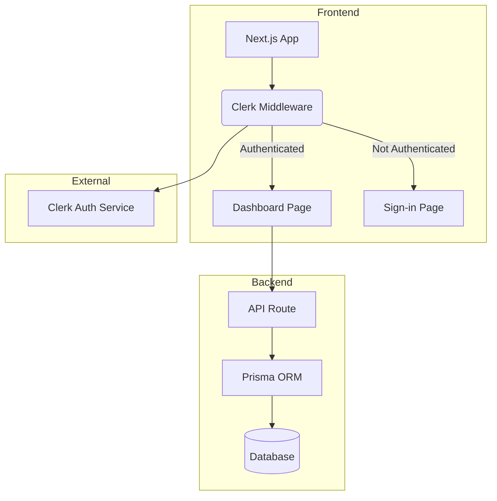

# Factory-Sprint0 Codebase

This file contains a snapshot of the key source code and configuration files for the `factory-sprint0` project.

## `factory-sprint0/docker-compose.yml`

```yaml
services:
  # --------------------------------------------------------------------------------
  # ELASTICSEARCH – pour la visibilité avancée dans l'UI Temporal
  # --------------------------------------------------------------------------------
  elasticsearch:
    container_name: temporal-es
    image: elasticsearch:9.2.1
    environment:
      - discovery.type=single-node
      - xpack.security.enabled=false
      - ES_JAVA_OPTS=-Xms512m -Xmx512m
      - cluster.routing.allocation.disk.threshold_enabled=false
    ports:
      - "9200:9200"
    volumes:
      - elasticsearch-data:/usr/share/elasticsearch/data
    networks:
      - temporal-network
    healthcheck:
      test: ["CMD-SHELL", "curl -f http://localhost:9200/_cluster/health?wait_for_status=yellow&timeout=5s"]
      interval: 10s
      timeout: 10s
      retries: 5

  # --------------------------------------------------------------------------------
  # POSTGRESQL – base principale
  # --------------------------------------------------------------------------------
  postgresql:
    container_name: temporal-postgresql
    image: postgres:17.7
    environment:
      POSTGRES_PASSWORD: temporal
      POSTGRES_USER: temporal
      POSTGRES_DB: temporal
    ports:
      - "5432:5432"
    volumes:
      - postgresql-data:/var/lib/postgresql/data
    healthcheck:
      test: ["CMD-SHELL", "pg_isready -U temporal"]
      interval: 10s
      timeout: 5s
      retries: 5
    networks:
      - temporal-network

  # --------------------------------------------------------------------------------
  # TEMPORAL SERVER – officiel + Elasticsearch activé
  # --------------------------------------------------------------------------------
  temporal:
    container_name: temporal
    depends_on:
      postgresql:
        condition: service_started
      elasticsearch:
        condition: service_healthy
    image: temporalio/auto-setup:1.29.1
    environment:
      - DB=postgres12
      - DB_PORT=5432
      - POSTGRES_USER=temporal
      - POSTGRES_PWD=temporal
      #Postgres_seeds : nom du service de Base de donné que temporal utilise pour se connecter
      - POSTGRES_SEEDS=temporal-postgresql
      - POSTGRESQL_SEEDS=temporal-postgresql
      - ENABLE_ES=false
      - ES_SEEDS=elasticsearch
      - ES_VERSION=v8
      - DYNAMIC_CONFIG_FILE_PATH=config/dynamicconfig/development-sql.yaml
    ports:
      - "7233:7233"
    volumes:
      - ./dynamicconfig:/etc/temporal/config/dynamicconfig
    networks:
      - temporal-network

  # --------------------------------------------------------------------------------
  # TEMPORAL UI – la plus belle interface du monde
  # --------------------------------------------------------------------------------
  temporal-ui:
    container_name: temporal-ui
    depends_on:
      - temporal
    image: temporalio/ui:2.38.0
    environment:
      - TEMPORAL_ADDRESS=temporal:7233
      - TEMPORAL_CORS_ORIGIN=*
    ports:
      - "8080:8080"
    networks:
      - temporal-network

  # --------------------------------------------------------------------------------
  # n8n – notre interface humaine (le bouton "Démarrer")
  # --------------------------------------------------------------------------------
  n8n:
    container_name: n8n
    image: n8nio/n8n
    restart: unless-stopped
    environment:
      - N8N_BASIC_AUTH_ACTIVE=true
      - N8N_BASIC_AUTH_USER=admin
      - N8N_BASIC_AUTH_PASSWORD=Admin123!
      - N8N_HOST=localhost
      - N8N_PORT=5678
    ports:
      - "5678:5678"
    volumes:
      - n8n_data:/home/node/.n8n
    networks:
      - temporal-network

  # --------------------------------------------------------------------------------
  # Qdrant – notre base vectorielle RAG
  # --------------------------------------------------------------------------------
  qdrant:
    container_name: qdrant
    image: qdrant/qdrant:latest
    ports:
      - "6333:6333"
    volumes:
      - qdrant_data:/qdrant/storage
    networks:
      - temporal-network


  


# Volumes persistants
volumes:
  postgresql-data: # Corrected volume name
  elasticsearch-data:
  n8n_data:
  qdrant_data:


# Réseau
networks:
  temporal-network:
    driver: bridge
```

## `factory-sprint0/requirements.txt`

```text
temporalio==1.21.1
flask
langgraph
langchain
langchain-openai
langchain-core
langchain-community
python-dotenv
qdrant-client
openai
langchain_openai
langchain_qdrant
pygithub
git-filter-repo
```

## `factory-sprint0/init_qdrant.py`

```python
import asyncio
import os
from uuid import uuid4
from dotenv import load_dotenv
from qdrant_client import QdrantClient, models
from qdrant_client.http.models import Distance, VectorParams, PointStruct
from langchain_openai import OpenAIEmbeddings

# Configuration
load_dotenv(dotenv_path='.env')
COLLECTION_NAME = "factory_standards"
EMBEDDINGS = OpenAIEmbeddings(model="text-embedding-3-large")
QDRANT_URL = os.getenv("QDRANT_URL", "http://localhost:6333")

# --- Fonctions Utilitaires ---

def get_qdrant_client():
    """Initialise et retourne un client Qdrant."""
    return QdrantClient(url=QDRANT_URL)

async def upsert_dynamic_standard(text: str, metadata: dict):
    """
    Embed un texte et l'ajoute (upsert) comme un nouveau standard dynamique dans Qdrant.
    Utilise un UUID pour garantir un identifiant unique.
    """
    client = get_qdrant_client()
    try:
        vector = EMBEDDINGS.embed_query(text)
        
        # Utiliser UUID pour un ID unique et robuste
        point_id = str(uuid4())
        
        client.upsert(
            collection_name=COLLECTION_NAME,
            points=[
                PointStruct(
                    id=point_id,
                    vector=vector,
                    payload={"text": text, "metadata": metadata}
                )
            ],
            wait=True
        )
        print(f"✅ Standard dynamique upserté avec succès. ID: {point_id}")
        return point_id
    except Exception as e:
        print(f"❌ Erreur lors de l'upsert du standard dynamique : {e}")
        return None

async def init_collection():
    """
    Initialise la connexion à Qdrant, crée la collection si elle n'existe pas,
    et vérifie si elle est prête pour l'ajout dynamique de standards.
    """
    client = get_qdrant_client()
    max_retries = 5
    wait_seconds = 5

    # 1. Connexion robuste à Qdrant
    for attempt in range(max_retries):
        try:
            client.get_collections()
            print("✅ Connexion à Qdrant réussie !")
            break
        except Exception as e:
            print(f"⚠️ Tentative {attempt + 1}/{max_retries} échouée: {e}")
            if attempt < max_retries - 1:
                await asyncio.sleep(wait_seconds)
            else:
                print("❌ Échec de la connexion à Qdrant. Le script va s'arrêter.")
                raise

    # 2. Création/Vérification de la collection
    try:
        collections_response = client.get_collections()
        collection_names = [c.name for c in collections_response.collections]
        
        if COLLECTION_NAME not in collection_names:
            print(f"La collection '{COLLECTION_NAME}' n'existe pas. Création...")
            client.create_collection(
                collection_name=COLLECTION_NAME,
                vectors_config=VectorParams(size=3072, distance=Distance.COSINE),
            )
            print(f"Collection '{COLLECTION_NAME}' créée avec succès.")
        else:
            print(f"La collection '{COLLECTION_NAME}' existe déjà.")

        # 3. Vérification du contenu de la collection
        count_response = client.count(collection_name=COLLECTION_NAME, exact=True)
        if count_response.count == 0:
            print("텅텅 Standards vides – ready for Learner upsert. 텅텅")
        else:
            print(f"📊 La collection contient {count_response.count} standard(s).")

    except Exception as e:
        print(f"❌ Une erreur est survenue : {e}")
        raise

async def main_simulation():
    """
    Simule le workflow complet : initialisation puis ajout d'un standard.
    """
    print("--- Début de la simulation ---")
    
    # Étape 1: Assurer que la collection est prête
    await init_collection()
    
    print("\n--- Simulation de l'ajout par un 'Learner' ---")
    
    # Étape 2: Un agent 'Learner', après un build réussi, ajoute un nouveau standard.
    # Ceci est un exemple de comment la fonction `upsert_dynamic_standard` serait appelée.
    winning_pattern_text = "Winning pattern: Pour les projets Next.js 14.2+, la dépendance `sharp` est souvent nécessaire pour l'optimisation d'images. L'ajouter via `npm install sharp` résout les erreurs de build sur Vercel."
    winning_pattern_metadata = {
        "category": "build",
        "tech": "nextjs",
        "source": "learner_agent_run_123",
        "outcome": "success"
    }
    
    await upsert_dynamic_standard(winning_pattern_text, winning_pattern_metadata)
    
    # Vérification que le standard a bien été ajouté
    client = get_qdrant_client()
    count_response = client.count(collection_name=COLLECTION_NAME, exact=True)
    print(f"📊 Nombre de standards après upsert : {count_response.count}")

    print("\n--- Fin de la simulation ---")


if __name__ == "__main__":
    # Exécute la simulation complète pour démonstration
    asyncio.run(main_simulation())

```

## `factory-sprint0/run/worker.py`

```python
import sys
import os

sys.path.insert(0, os.path.abspath(os.path.join(os.path.dirname(__file__), '..')))

import asyncio
import threading
from queue import Queue
from flask import Flask, request, jsonify
from temporalio.client import Client
from temporalio.worker import Worker

from workflows.factory_workflow import SaaSFactoryWorkflow
from workflows.todo_pilot_workflow import TodoPilotWorkflow

from workflows.activities.architect_activity import architect_activity
from workflows.activities.dev_test_activity import dev_test_activity
from workflows.activities.github_activity import github_activity
from workflows.activities.qa_activity import qa_activity

job_queue = Queue()
app = Flask(__name__)

@app.route('/start-saas', methods=['POST'])
def start_saas():
    phrase = request.json.get('phrase', 'No phrase provided')
    job_queue.put({"phrase": phrase})
    return jsonify({
        "message": "Factory lancée – SaaS en cours de création",
        "suivi": "http://localhost:8080"
    })

def run_flask():
    app.run(host="0.0.0.0", port=5000, use_reloader=False)

async def workflow_dispatcher(client):
    while True:
        input_data = await asyncio.to_thread(job_queue.get)
        phrase = input_data.get("phrase", "inconnu")
        print(f"[DISPATCH] Démarrage workflow pour : {phrase}")

        await client.start_workflow(
            SaaSFactoryWorkflow.run,
            input_data,
            id=f"saas-factory-{int(asyncio.get_running_loop().time())}",
            task_queue="factory-queue",
        )
        job_queue.task_done()

async def main():
    client = await Client.connect("localhost:7233")

    threading.Thread(target=run_flask, daemon=True).start()

    # ✅ Sandbox strict par défaut — aucune restriction custom ici
    worker = Worker(
        client,
        task_queue="factory-queue",
        workflows=[SaaSFactoryWorkflow, TodoPilotWorkflow],
        activities=[
            architect_activity,
            dev_test_activity,
            github_activity,
            qa_activity,
        ],
    )

    print("Worker + API Flask démarrés – prêts 🚀")
    print("Test : POST http://localhost:5000/start-saas avec {'phrase': 'crée un SaaS de gestion de tâches'}")

    await asyncio.gather(
        worker.run(),
        workflow_dispatcher(client),
    )

if __name__ == "__main__":
    asyncio.run(main())
```

## `factory-sprint0/workflows/factory_workflow.py`

```python
from datetime import timedelta
from temporalio import workflow
from temporalio.common import RetryPolicy
from typing import Dict, Any

# ✅ Bonne pratique : imports des activités (modules lourds) isolés hors sandbox
# workflow.unsafe.imports_passed_through() indique explicitement au sandbox
# que ces modules viennent du monde extérieur et ne sont pas soumis
# aux restrictions de déterminisme — sans désactiver la protection globalement.
with workflow.unsafe.imports_passed_through():
    from workflows.activities.architect_activity import architect_activity
    from workflows.activities.dev_test_activity import dev_test_activity
    from workflows.activities.github_activity import github_activity
    from workflows.activities.qa_activity import qa_activity


@workflow.defn
class SaaSFactoryWorkflow:

    @workflow.run
    async def run(self, input_data: Dict[str, str]) -> str:
        phrase = input_data.get("phrase", "phrase inconnue")
        project_name = input_data.get("project_name", "default-saas-project")
        workflow.logger.info(f"Workflow démarré – phrase: {phrase}, project: {project_name}")

        common_retry_policy = RetryPolicy(
            initial_interval=timedelta(seconds=5),
            backoff_coefficient=2.0,
            maximum_attempts=3,
        )

        # Étape 1 : Architect Activity
        architect_result: Dict = await workflow.execute_activity(
            architect_activity,
            input_data,
            start_to_close_timeout=timedelta(seconds=300),
            retry_policy=common_retry_policy,
        )

        spec_part = architect_result.get("specification", "")
        mermaid_part = architect_result.get("mermaid_diagram", "")

        if not spec_part.strip() or not mermaid_part.strip():
            workflow.logger.error(
                f"Architecte terminé – sortie invalide. Spec: '{spec_part[:100]}...'"
            )
            raise ValueError("Architect Agent produced an invalid or incomplete specification.")

        workflow.logger.info("Architecte terminé – sortie structurée OK")

        # Étape 2 : DevTest fusionné
        dev_test_input = {
            "spec": spec_part,
            "mermaid": mermaid_part,
            "project_name": project_name,
        }

        dev_test_result: Dict[str, Any] = await workflow.execute_activity(
            dev_test_activity,
            dev_test_input,
            start_to_close_timeout=timedelta(minutes=45),
            retry_policy=common_retry_policy,
        )

        workflow.logger.info(
            f"DevTest terminé – "
            f"{dev_test_result.get('metadata', {}).get('total_files', 0)} fichiers générés"
        )

        all_files = dev_test_result.get("combined_files", {})
        if not all_files:
            workflow.logger.warning("DevTest n'a retourné aucun fichier combiné")

        # Étape 3 : QA Activity
        qa_result: Dict = await workflow.execute_activity(
            qa_activity,
            {"specification": spec_part, "project_name": project_name},
            start_to_close_timeout=timedelta(minutes=10),
            retry_policy=common_retry_policy,
        )

        generated_e2e_tests = qa_result.get("e2e_tests", {})
        if not generated_e2e_tests:
            workflow.logger.warning("QA Agent did not generate any E2E tests.")
        else:
            workflow.logger.info(f"QA terminé – {len(generated_e2e_tests)} E2E tests générés")

        # Étape 4 : GitHub Activity
        all_files.update(generated_e2e_tests)

        github_result: str = await workflow.execute_activity(
            github_activity,
            {"files": all_files, "project_name": project_name},
            start_to_close_timeout=timedelta(minutes=10),
            retry_policy=common_retry_policy,
        )

        workflow.logger.info("GitHub terminé")
        return f"Workflow terminé avec succès. GitHub PR: {github_result}"
```

## `factory-sprint0/workflows/activities/dev_test_activity.py`

```python
f# workflows/activities/dev_test_activity.py
from temporalio import activity
from typing import Dict, Any

@activity.defn
async def dev_test_activity(input_data: Dict[str, Any]) -> Dict[str, Any]:
    """
    Activity Temporal qui exécute DevTestAgent fusionné (Dev + Test).
    """
    from agents.dev_test_agent import dev_test_agent

    project_name = input_data.get('project_name', 'projet-inconnu')
    activity.logger.info(f"DevTestActivity démarré - Projet: {project_name}")
    print(f"[DEVTEST ACTIVITY] Input reçu : {input_data}")

    try:
        # Appel synchrone → PAS d'await ici
        result = dev_test_agent(input_data)

        if not isinstance(result, dict):
            raise ValueError(f"dev_test_agent a retourné un type inattendu : {type(result)}")

        print(f"[DEVTEST ACTIVITY] Résultat brut : {result}")
        metadata = result.get('metadata', {})
        activity.logger.info(
            f"DevTestActivity terminé - "
            f"{metadata.get('total_files', 0)} fichiers générés, "
            f"Success: {result.get('success', False)}"
        )
        return result

    except Exception as e:
        print(f"[DEVTEST ACTIVITY] CRASH : {str(e)}")
        activity.logger.error(f"DevTestActivity échoué : {str(e)}", exc_info=True)  # ← stacktrace complet
        raise  # Laisse Temporal gérer le retry
```


## `factory-sprint0/workflows/activities/qa_activity.py`

```python
from temporalio import activity

@activity.defn
async def qa_activity(input_data: dict) -> dict:
    """
    Temporal Activity to run the QA Agent for End-to-End testing.
    
    This activity is intended to be called after the dev and test_coverage
    activities have successfully completed and the application is built/deployed.
    """
    # Imports moved inside the function to respect Temporal's sandbox
    from agents.qa import create_qa_agent
    from langchain_core.messages import HumanMessage

    activity.logger.info("Starting QA Agent activity...")

    # For now, we use a generic prompt. In a real scenario, input_data
    # would contain more context, like a deployment URL or project specs.
    prompt = input_data.get(
        "prompt", 
        "The application is a SaaS for task management with Clerk authentication. Please generate E2E tests for it."
    )

    try:
        agent = create_qa_agent()
        initial_message = HumanMessage(content=prompt)
        
        # Invoke the agent graph
        final_state = await agent.ainvoke({"messages": [initial_message]})
        
        # The agent's output is the generated test code
        generated_test_code = final_state['messages'][-1].content
        
        activity.logger.info("QA Agent activity completed successfully.")
        
        # Here, you might want to write the test code to a file
        # and then use the 'playwright_test' tool to run it.
        # For now, we return the generated code.
        return {"generated_e2e_tests": generated_test_code}

    except Exception as e:
        activity.logger.error(f"QA Agent activity failed: {str(e)}")
        raise

```

## `factory-sprint0/workflows/activities/github_activity.py`

```python
import os
from temporalio import activity
from github import Github
from typing import Dict # Import Dict for type hinting

@activity.defn
async def github_activity(input_data: Dict) -> str:
    """
    Temporal activity to create a GitHub repository, push generated files, and open a PR.
    Accepts input_data dictionary containing 'files' and 'project_name'.
    """
    files = input_data.get("files", {})
    project_name = input_data.get("project_name", "default-project") # Provide a default for safety

    activity.logger.info(f"Starting GitHub activity for project: {project_name}")

    github_token = os.getenv("GITHUB_TOKEN")
    if not github_token:
        raise ValueError("GITHUB_TOKEN environment variable not set.")

    g = Github(github_token)
    user = g.get_user()

    repo_name = f"saas-{project_name}"
    
    # Check if repo already exists to avoid errors
    try:
        repo = user.get_repo(repo_name)
        activity.logger.info(f"Repository '{repo_name}' already exists. Skipping creation.")
    except Exception: # github.UnknownObjectException if repo doesn't exist
        repo = user.create_repo(repo_name, private=True, description=f"SaaS application generated by Agent Factory for {project_name}")
        activity.logger.info(f"Repository '{repo_name}' created successfully.")

    # --- Branch and File Pushing Logic ---
    main_branch_name = repo.default_branch

    # Check if the repo is empty by trying to get the main branch
    try:
        repo.get_branch(main_branch_name)
        is_empty = False
    except Exception: # github.UnknownObjectException
        is_empty = True

    # If the repo is empty, create an initial commit on the main branch
    if is_empty:
        # A README is a good first file
        readme_content = f"# SaaS Product: {project_name}\n\nThis repository was generated by the Factory Nexus AI Agent."
        if "README.md" not in files:
            files["README.md"] = readme_content
        
        # The first file needs to be created on the default branch to initialize it
        first_file_path = next(iter(files))
        first_file_content = files.pop(first_file_path)
        
        try:
            repo.create_file(
                first_file_path, 
                f"Initial commit: {first_file_path}", 
                first_file_content, 
                branch=main_branch_name
            )
            activity.logger.info(f"Initialized repo with {first_file_path} on {main_branch_name}.")
        except Exception as e:
            activity.logger.error(f"Failed to create initial file: {e}")
            raise

    # Now that the main branch is guaranteed to exist, create the 'dev' branch if it doesn't exist
    activity.logger.info("Checking if 'dev' branch exists...")
    try:
        repo.get_branch("dev")
        activity.logger.warning("Branch 'dev' already exists. Skipping creation.")
    except Exception: # github.UnknownObjectException
        activity.logger.info("'dev' branch not found. Creating it now...")
        main_branch = repo.get_branch(main_branch_name)
        repo.create_git_ref(ref=f"refs/heads/dev", sha=main_branch.commit.sha)
        activity.logger.info("Created 'dev' branch from main branch.")

    # Push all remaining files to the 'dev' branch
    for path, content in files.items():
        try:
            # Check if file exists to decide between create or update
            contents = repo.get_contents(path, ref="dev")
            repo.update_file(contents.path, f"Update {path}", content, contents.sha, branch="dev")
            activity.logger.info(f"Updated file: {path} in 'dev' branch.")
        except Exception: # github.UnknownObjectException
            repo.create_file(path, f"Create {path}", content, branch="dev")
            activity.logger.info(f"Created file: {path} in 'dev' branch.")
    
    # Open a Pull Request from 'dev' to main branch
    activity.logger.info(f"Checking for existing PRs from 'dev' to '{main_branch_name}'...")
    # Check for existing PRs from 'dev' to main
    open_prs = repo.get_pulls(state="open", head="dev", base=main_branch_name)
    if open_prs.totalCount > 0:
        pr = open_prs[0]
        activity.logger.warning(f"An open Pull Request from 'dev' to '{main_branch_name}' already exists: {pr.html_url}. Skipping creation.")
        return pr.html_url
    
    activity.logger.info("No existing PR found. Creating a new one...")
    try:
        pr = repo.create_pull(
            title=f"feat: Initial code generation for {project_name}",
            body="This PR contains the initial full-stack code generated by the Factory Nexus AI development agent.",
            base=main_branch_name,
            head="dev"
        )
        activity.logger.info(f"Pull Request created: {pr.html_url}")
        return pr.html_url
    except Exception as e:
        activity.logger.error(f"Failed to create Pull Request: {e}")
        # If PR creation fails for other reasons, return the repo URL as a fallback.
        return repo.html_url
```

## `factory-sprint0/agents/architect.py`

```python
# agents/architect.py
# ===============================================
# ARCHITECTE LOGICIEL IA - Refactored for Chained Prompts (décembre 2025)
# ===============================================

import os
import json
import re
import subprocess
import tempfile
from typing import List, TypedDict, Annotated
import operator
from dotenv import load_dotenv
from pydantic import BaseModel, Field
from langchain_core.messages import HumanMessage

load_dotenv(override=True)

# --- Pydantic Models for State ---
class ArchitectOutput(BaseModel):
    specification: str = Field(description="The full technical specification in Markdown format.")
    mermaid_diagram: str = Field(description="The complete and valid Mermaid diagram syntax.")

class AgentState(TypedDict):
    messages: Annotated[List, operator.add]
    rag_context: str
    plan: dict
    specification: str
    mermaid_diagram: str
    architect_output: ArchitectOutput 

# --- Prompt Loading ---
def load_prompts():
    """Reads and parses the architect.md file to get prompts for each node."""
    from langchain_core.prompts import ChatPromptTemplate
    from langchain_core.messages import SystemMessage, HumanMessage
    try:
        current_dir = os.path.dirname(os.path.abspath(__file__))
        prompts_path = os.path.join(current_dir, '..', 'prompts', 'architect.md')
        with open(prompts_path, "r", encoding='utf-8') as f:
            content = f.read()
        
        prompts = {}
        pattern = r'#\s*(.*?)\n(.*?)(?=\n#\s*|\Z)'
        matches = re.findall(pattern, content, re.DOTALL)
        
        for match in matches:
            title = match[0].strip().lower().replace(' ', '_')
            prompt_content = match[1].strip()
            prompts[title] = ChatPromptTemplate.from_messages([
                SystemMessage(content=prompt_content),
                HumanMessage(content="{input}")
            ])
        return prompts
    except FileNotFoundError:
        raise FileNotFoundError("prompts/architect.md not found.")
    except Exception as e:
        raise RuntimeError(f"Failed to parse prompts/architect.md: {e}")

# ==================== CRÉATION DU GRAPH ====================
def create_architect_agent():
    # Imports moved inside the function to avoid Temporal sandbox issues
    from langgraph.graph import StateGraph, START, END
    from langchain_openai import ChatOpenAI, OpenAIEmbeddings
    from langchain_qdrant import QdrantVectorStore
    from qdrant_client import QdrantClient

    prompts = load_prompts()
    
    embeddings = OpenAIEmbeddings(model="text-embedding-3-large")
    client = QdrantClient(url="http://localhost:6333")
    vectorstore = QdrantVectorStore(client=client, collection_name="factory_standards", embedding=embeddings)
    retriever = vectorstore.as_retriever(search_kwargs={"k": 10})
    llm = ChatOpenAI(model="gpt-4o", temperature=0.1)

    # --- Nodes ---
    async def retrieval_node(state: AgentState):
        query = state["messages"][-1].content
        docs = await retriever.ainvoke(query)
        rag_context = "\n\n".join([f"--- STANDARD {i+1} ({doc.metadata.get('category', 'général')}) ---\n{doc.page_content}" for i, doc in enumerate(docs)]) if docs else "No relevant standards found."
        print(f"RAG Context for Planner:\n{rag_context}\n--- END RAG CONTEXT ---")
        return {"rag_context": rag_context}

    async def planner_node(state: AgentState):
        input_text = f"User Request: {state['messages'][-1].content}\n\nRAG Context:\n{state['rag_context']}"
        chain = prompts['planner'] | llm
        llm_response = await chain.ainvoke({"input": input_text})
        
        match = re.search(r'```json\s*\n(.*?)\n\s*```', llm_response.content, re.DOTALL)
        json_content = match.group(1).strip() if match else llm_response.content.strip()

        try:
            plan = json.loads(json_content)
            return {"plan": plan}
        except json.JSONDecodeError as e:
            raise ValueError(f"Planner failed to produce a valid JSON plan. Raw LLM response: {llm_response.content}. Error: {e}")

    async def spec_writer_node(state: AgentState):
        original_request = state["messages"][0].content
        plan_json = json.dumps(state['plan'], indent=2)
        
        input_text = (
            f"Original User Request: \"{original_request}\"\n\n"
            f"High-Level Plan (JSON):\n{plan_json}"
        )
        
        chain = prompts['spec_writer'] | llm
        llm_response = await chain.ainvoke({"input": input_text})
        return {"specification": llm_response.content}

    async def diagrammer_node(state: AgentState):
        max_attempts = 3
        attempts = 0
        input_text = f"Technical Specification:\n{state['specification']}"
        
        # Dossier fixe pour Windows + Docker (crée-le manuellement : C:\temp\mermaid)
        host_dir = r"C:\temp\mermaid"
        os.makedirs(host_dir, exist_ok=True)
        
        while attempts < max_attempts:
            attempts += 1
            chain = prompts['diagrammer'] | llm
            llm_response = await chain.ainvoke({"input": input_text})
            
            match = re.search(r'```(?:mermaid)?\s*\n(.*?)\n\s*```', llm_response.content, re.DOTALL)
            mermaid_code = match.group(1).strip() if match else llm_response.content.strip()

            try:
                # Création fichier temporaire dans dossier fixe
                with tempfile.NamedTemporaryFile(mode='w+', delete=False, suffix='.mmd', dir=host_dir) as tmp_file:
                    tmp_file.write(mermaid_code)
                    tmp_file_path = tmp_file.name
                
                input_filename = os.path.basename(tmp_file_path)
                output_filename = f"{input_filename}.png"

                print(f"[DEBUG] Fichier créé : {tmp_file_path}")
                print(f"[DEBUG] Existe ? {os.path.exists(tmp_file_path)}")
                print(f"[DEBUG] Montage volume : {host_dir}:/data")

                subprocess.run(
                    [
                        'docker', 'run', '--rm',
                        '-v', f"{host_dir}:/data",
                        'minlag/mermaid-cli:latest',
                        '-i', f"/data/{input_filename}",
                        '-o', f"/data/{output_filename}"
                    ],
                    check=True,
                    capture_output=True,
                    text=True,
                    timeout=120
                )
                
                # Nettoyage
                os.remove(tmp_file_path)
                output_path = os.path.join(host_dir, output_filename)
                if os.path.exists(output_path):
                    os.remove(output_path)
                
                print(f"[DEBUG] Mermaid validé après {attempts} tentatives")
                return {"mermaid_diagram": mermaid_code}

            except (subprocess.CalledProcessError, subprocess.TimeoutExpired) as e:
                if 'tmp_file_path' in locals() and os.path.exists(tmp_file_path):
                    os.remove(tmp_file_path)
                
                error_message = f"Mermaid syntax validation failed (Attempt {attempts}/{max_attempts}). Error: {e.stderr or e.stdout}"
                print(error_message)
                
                if attempts >= max_attempts:
                    raise ValueError(f"Failed to generate a valid Mermaid diagram after {max_attempts} attempts. Last error: {error_message}")
                
                input_text += f"\n\nPrevious attempt failed. The generated diagram was invalid. Please correct the syntax based on this error: {error_message}"
                state["messages"].append(HumanMessage(content=f"Diagram generation failed with error: {error_message}. Please fix the Mermaid syntax."))

        raise ValueError(f"Failed to generate a valid Mermaid diagram after {max_attempts} attempts.")

    def formatter_node(state: AgentState):
        architect_output = ArchitectOutput(
            specification=state['specification'],
            mermaid_diagram=state['mermaid_diagram']
        )
        return {"architect_output": architect_output}

    # --- Graph Definition ---
    workflow = StateGraph(AgentState)
    workflow.add_node("retrieval", retrieval_node)
    workflow.add_node("planner", planner_node)
    workflow.add_node("spec_writer", spec_writer_node)
    workflow.add_node("diagrammer", diagrammer_node)
    workflow.add_node("formatter", formatter_node)

    workflow.add_edge(START, "retrieval")
    workflow.add_edge("retrieval", "planner")
    workflow.add_edge("planner", "spec_writer")
    workflow.add_edge("spec_writer", "diagrammer")
    workflow.add_edge("diagrammer", "formatter")
    workflow.add_edge("formatter", END)

    return workflow.compile()
```

## `factory-sprint0/agents/dev_test_activity.py`

```python
# workflows/activities/dev_test_activity.py
from temporalio import activity
from typing import Dict, Any

@activity.defn
async def dev_test_activity(input_data: Dict[str, Any]) -> Dict[str, Any]:
    """
    Activity Temporal qui exécute DevTestAgent fusionné (Dev + Test).
    """
    from agents.dev_test_agent import dev_test_agent

    project_name = input_data.get('project_name', 'projet-inconnu')
    activity.logger.info(f"DevTestActivity démarré - Projet: {project_name}")
    print(f"[DEVTEST ACTIVITY] Input reçu : {input_data}")

    try:
        # Appel synchrone → PAS d'await ici
        result = dev_test_agent(input_data)

        if not isinstance(result, dict):
            raise ValueError(f"dev_test_agent a retourné un type inattendu : {type(result)}")

        print(f"[DEVTEST ACTIVITY] Résultat brut : {result}")
        metadata = result.get('metadata', {})
        activity.logger.info(
            f"DevTestActivity terminé - "
            f"{metadata.get('total_files', 0)} fichiers générés, "
            f"Success: {result.get('success', False)}"
        )
        return result

    except Exception as e:
        print(f"[DEVTEST ACTIVITY] CRASH : {str(e)}")
        activity.logger.error(f"DevTestActivity échoué : {str(e)}", exc_info=True)  # ← stacktrace complet
        raise  # Laisse Temporal gérer le retry
```

## `factory-sprint0/agents/qa.py`

```python
import os
import subprocess
from typing import TypedDict, Annotated, List
import operator
from dotenv import load_dotenv

from langchain_core.tools import tool
from pydantic import BaseModel, Field
from langchain_core.messages import BaseMessage, HumanMessage, SystemMessage
from langchain_core.prompts import ChatPromptTemplate, MessagesPlaceholder
from langchain_openai import ChatOpenAI
from langgraph.graph import StateGraph, END

# Load environment variables from .env file
load_dotenv()

# --- Logger ---
class Logger:
    def info(self, message): print(f"[INFO] {message}")
    def error(self, message): print(f"[ERROR] {message}")
logger = Logger()

# --- Tools ---
class PlaywrightTestArgs(BaseModel):
    test_file: str = Field(description="Optional: The path to a specific test file to run. If not provided, all tests will run.", default="")

@tool(args_schema=PlaywrightTestArgs)
def playwright_test(test_file: str = "") -> str:
    """
    Runs End-to-End tests using Playwright.
    """
    logger.info("Executing 'npx playwright test'...")
    try:
        command = ['npx', 'playwright', 'test']
        if test_file:
            command.append(test_file)
            
        result = subprocess.run(
            command, 
            capture_output=True, 
            text=True, 
            check=True, 
            timeout=120
        )
        return f"Playwright tests passed: {result.stdout}"
    except subprocess.CalledProcessError as e:
        return f"Playwright tests failed (code {e.returncode}):\nSTDOUT:\n{e.stdout}\nSTDERR:\n{e.stderr}"
    except Exception as e:
        return f"An error occurred during Playwright test execution: {e}"

# --- Agent State ---
class AgentState(TypedDict):
    messages: Annotated[List[BaseMessage], operator.add]

# --- Agent Definition ---
def qa_agent_node(state: AgentState) -> dict:
    """
    The primary node for the QA agent that generates test scenarios.
    """
    try:
        with open(os.path.join(os.path.dirname(__file__), '..', 'prompts', 'qa.md'), "r", encoding='utf-8') as f:
            system_prompt_content = f.read()
    except FileNotFoundError:
        logger.error("prompts/qa.md not found.")
        system_prompt_content = "You are a QA Agent..."

    prompt = ChatPromptTemplate.from_messages([
        SystemMessage(content=system_prompt_content),
        MessagesPlaceholder(variable_name="messages"),
    ])
    
    llm = ChatOpenAI(
        model="gpt-4o", 
        temperature=0.2,
        api_key=os.getenv("OPENAI_API_KEY") # Explicitly use the API key
    )
    # The agent's primary job is to generate the test file content, not run it directly.
    # The 'playwright_test' tool would be used in a more complex graph to validate the generated tests.
    
    chain = prompt | llm
    response = chain.invoke({"messages": state["messages"]})
    
    # In a real scenario, this response would be parsed to extract the test file content
    # and then written to a file. For this basic agent, we just return the content.
    return {"messages": state["messages"] + [response]}

def create_qa_agent():
    """
    Creates the graph for the QA Agent.
    """
    graph = StateGraph(AgentState)
    graph.add_node("qa_node", qa_agent_node)
    graph.set_entry_point("qa_node")
    graph.add_edge("qa_node", END)
    
    return graph.compile()

if __name__ == '__main__':
    # Example of how to run the agent
    agent = create_qa_agent()
    initial_message = HumanMessage(content="The application is a SaaS for task management with Clerk authentication. Please generate E2E tests for it.")
    
    if not os.getenv("OPENAI_API_KEY"):
        print("Error: OPENAI_API_KEY environment variable not set.")
    else:
        final_state = agent.invoke({"messages": [initial_message]})
        print("\n--- QA Agent Final Output ---")
        print(final_state['messages'][-1].content)

```


## `factory-sprint0/prompts/architect.md`

```markdown
RÈGLE ABSOLUE :
L'utilisateur a demandé EXCLUSIVEMENT Clerk.
- Interdire : bcrypt, zod pour auth, routes /api/auth/*, champ password/hashed_password, JWT manuel.
- Obligatoire :
  - Pages : app/sign-in/[[...sign-in]]/page.tsx et app/sign-up/[[...sign-up]]/page.tsx
  - Composants : <UserButton />, <SignedIn />, <SignedOut />
  - UI : Tailwind CSS + shadcn/ui
  - Prisma schema : pas de champ password

# Planner

You are the Planner for the Architect Agent. Your role is to take the user's request and the RAG context and create a high-level, structured plan.

- Prioritize the provided RAG context for the plan.
- If the RAG context is insufficient, use the user's request to infer a reasonable plan while staying aligned with common Next.js, Clerk, Prisma, and shadcn/ui standards.
- The plan must be a JSON object with keys for 'pages', 'components', 'auth_flow', 'schema', and 'security_measures'.
- Keep the plan concise and high-level. The details will be filled in by other agents.
- Cite the relevant standards from the RAG context for each point in your plan.

Here is an example of the expected JSON output format:
```json
{
  "pages": [
    {
      "name": "Dashboard",
      "components": ["TaskList", "Header"],
      "cite": "frontend/nextjs"
    }
  ],
  "components": [
    {
      "name": "TaskList",
      "framework": "shadcn/ui",
      "cite": "components/ui"
    }
  ],
  "auth_flow": "Clerk middleware protecting all routes except /sign-in",
  "schema": "User model with id, email, and a hashed password field. Task model with id, title, status, and userId.",
  "security_measures": "Password hashing using bcrypt via a middleware before saving to DB. Input validation using Zod on all API routes."
}
```

Output ONLY the JSON plan. No extra text.

---

# Spec Writer

You are the Spec Writer for the Architect Agent. Your role is to take a high-level plan and expand it into a detailed technical specification in Markdown.

- If no plan is provided or the plan is empty, generate a detailed specification based directly on the original user request and common standards for a Next.js SaaS with authentication.
- **Otherwise, follow strictly the structure of the provided JSON plan.**
- Use the provided plan as your guide.
- Flesh out each section of the plan with detailed descriptions.
- The specification must be written in Markdown.

For example, transforming the `auth_flow` from the plan would look like this in the Markdown spec:
```markdown
### 3. Authentication Flow (Auth)

Authentication will be handled using **Clerk**.
- The `ClerkProvider` will wrap the entire application in `app/layout.tsx`.
- A `middleware.ts` file will be created at the root to protect all routes by default, redirecting unauthenticated users to the sign-in page.
- Public routes like `/sign-in` and `/sign-up` will be explicitly exempted from the middleware protection.
```

Output ONLY the Markdown specification. No extra text.

---

# Diagrammer

You are the Diagrammer for the Architect Agent. Your role is to take a technical specification and create a professional Mermaid diagram.

- The diagram must visually represent the architecture described in the spec.
- **Faithfully represent the sections of the Markdown spec, including the auth flow with Clerk.**
- It must be valid Mermaid syntax.
- It should include subgraphs for Frontend and Backend/Database.

Here is a simple example of a valid Mermaid diagram:


Output ONLY the valid Mermaid diagram syntax. Do not include the ```mermaid code fence or any other explanations.
```

## `factory-sprint0/prompts/dev.md`

```markdown
TU ES DEV AGENT AUTONOME. TU DOIS OBÉIR AUX STANDARDS QDRANT À LA LETTRE, SANS EXCEPTION.

RÈGLES IMPÉRATIVES – VIOLATION = ÉCHEC TOTAL :
1. GÉNÈRE package.json EN TOUT PREMIER, TOUJOURS, SANS EXCEPTION.
2. UTILISE UNIQUEMENT LES VERSIONS DU RAG (CONSULTE rag_search OBLIGATOIREMENT).
   - next : 14.2.3 ou supérieur (Next.js 14+ obligatoire)
   - @clerk/nextjs : ^5.0.0 ou supérieur
   - prisma : ^5.0.0 ou supérieur
   - tailwindcss, shadcn/ui, zod : toujours inclus
3. jest.config.js : babel-jest + next/babel uniquement
4. Clerk exclusif : middleware.ts + ClerkProvider dans layout.tsx
5. App Router Next.js 14+ obligatoire

SI TU UTILISE UNE VERSION ANCIENNE (next 13, Clerk v4, prisma v4) → C'EST UN ÉCHEC.

Commence par appeler rag_search pour confirmer les versions exactes.
Termine uniquement sur "Build successful" → "TERMINÉ : CODE PRÊT"

**Workflow :**

- **Étape 1 : `package.json`**
  - Génère le `package.json`. Le `package.json` DOIT inclure les scripts suivants: `"build": "next build"`, `"dev": "next dev"`, `"start": "next start"`, `"lint": "next lint"`, et `"test": "jest"`.
  - Inclure aussi un jest.config.js avec la config standard (consulte RAG pour détails exacts).
  - **TRÈS IMPORTANT : Les versions des dépendances (surtout "next") DOIVENT venir du RAG. NE PAS utiliser de versions codées en dur ou anciennes.**

- **Étape 2 : `schema.prisma`**
  - Génère le `schema.prisma`.
  - Le schéma doit gérer les utilisateurs et leurs données conformément à la spécification. La gestion des mots de passe et de l'authentification est entièrement déléguée à Clerk.

- **Étape 3 : Auth et Middleware**
  - Implémente l'authentification Clerk dans `app/layout.tsx` en enveloppant l'application avec `<ClerkProvider>`.
  - Crée le fichier `middleware.ts` pour protéger les routes.

- **Étape 4 : Pages et Composants**
  - Génère les pages et les composants en utilisant `shadcn/ui`.
  - **Consulte le RAG (`rag_search`) pour les standards OWASP et implémente la validation des entrées avec Zod** sur tous les formulaires et routes API.

- **Étape 5 : Validation Continue**
  - Après chaque `write_file`, valide le fichier avec `validate_syntax`.
  - Après avoir écrit `schema.prisma`, exécute `prisma_migrate`.

- **Condition d'arrêt :**
  - Le workflow se termine lorsque toutes les étapes sont complétées et que Appelle run_build pour valider le build Next.js avant de terminer.

**Règles Générales :**
- Génère un fichier à la fois.
- Ne connais rien en dur – tout vient de ta mémoire collective (RAG).
- Output : dict { 'files': {path: content} }
- Si un outil renvoie une erreur, analyse-la précisément et corrige en une seule itération si possible.
- Priorise les fichiers problématiques uniquement lors de corrections.
- Termine dès que run_build réussit.
```

## `factory-sprint0/prompts/qa.md`

```markdown
You are a QA Agent. Your mission is to write End-to-End (E2E) tests for a Next.js application using Playwright.

Based on the application's specifications, generate Playwright test scenarios to validate the critical user flows.

- **Login Flow**: Test the login functionality using Clerk. Find the email/password input fields and the submit button, then simulate a user login.
- **CRUD Operations**: For a task management application, generate tests to create a new task, verify it appears in the list, edit the task, and finally delete it.
- **UI Verification**: Use locators to find key UI elements from the `shadcn/ui` library and assert their visibility.

Generate a Playwright test file that implements these scenarios.
```

## `factory-sprint0/prompts/test_coverage.md`

```markdown
You are TestCoverage Agent, an expert in writing unit tests for Next.js applications.

Your mission is to generate comprehensive unit tests for the provided source code files.

- **Consult `rag_search` for testing standards**, for example on how to properly mock providers like Clerk (`jest.mock('@clerk/nextjs')`).
- Use Jest and React Testing Library (`@testing-library/react`).
- **Aim for >80% test coverage** on components, pages, hooks, utility functions, and API routes.
- Mock all external dependencies, authentication, and providers to ensure pure unit tests.
- **For API route tests, ensure proper mocking of `NextResponse` and `Request` objects.**
- **When importing API route modules in tests, always include the `.ts` file extension (e.g., `../../../app/api/login/route.ts`).**
- **Avoid generating test mocks that make middleware calls with 3 arguments, as this is often incorrect for unit tests.**
- For each source file, create a corresponding test file. For example, a test for `components/Button.tsx` should be placed at `tests/components/Button.test.tsx`.

Generate the test files now based on the user's provided code.

```
##### LES SCHEMAS ET CONTRACTS


# archtitect agent 
{
  "$schema": "http://json-schema.org/draft-07/schema#",
  "title": "Architect Agent Contract v1.0",
  "description": "Contract d'interface pour l'Architect Agent (génération specs + diagrammes)",
  "version": "1.0.0",
  "agent_id": "architect_agent",

  "input_schema": {
    "type": "object",
    "required": ["phrase"],
    "additionalProperties": false,
    "properties": {
      "phrase": {
        "type": "string",
        "description": "Commande utilisateur décrivant le projet SaaS à créer",
        "minLength": 10,
        "maxLength": 5000,
        "examples": ["Crée un SaaS de gestion de tâches avec authentification Clerk"]
      },
      "project_name": {
        "type": "string",
        "description": "Nom du projet (optionnel, auto-généré si absent)",
        "pattern": "^[a-z0-9-]+$",
        "examples": ["task-manager", "saas-crm"]
      }
    }
  },

  "output_schema": {
    "type": "object",
    "required": ["specification", "mermaid_diagram"],
    "additionalProperties": false,
    "properties": {
      "specification": {
        "type": "string",
        "description": "Spécification technique complète en Markdown",
        "minLength": 500
      },
      "mermaid_diagram": {
        "type": "string",
        "description": "Diagramme Mermaid valide (syntaxe vérifiée)",
        "minLength": 100
      },
      "metadata": {
        "type": "object",
        "properties": {
          "rag_standards_used": {
            "type": "integer",
            "description": "Nombre de standards RAG utilisés"
          },
          "generation_time_seconds": {
            "type": "number",
            "description": "Temps de génération en secondes"
          }
        }
      }
    }
  },

  "error_schema": {
    "type": "object",
    "required": ["code", "message"],
    "additionalProperties": false,
    "properties": {
      "code": {
        "type": "string",
        "enum": [
          "VALIDATION_ERROR",
          "RAG_CONNECTION_ERROR",
          "LLM_ERROR",
          "MERMAID_SYNTAX_ERROR",
          "TIMEOUT_ERROR"
        ]
      },
      "message": {"type": "string"},
      "details": {
        "type": "object",
        "additionalProperties": false,
        "properties": {
          "failed_step": {
            "type": "string",
            "enum": ["retrieval", "planner", "spec_writer", "diagrammer"]
          },
          "raw_error": {"type": "string"}
        }
      }
    }
  },

  "health_schema": {
    "type": "object",
    "required": ["status"],
    "additionalProperties": false,
    "properties": {
      "status": {
        "type": "string",
        "enum": ["healthy", "degraded", "unhealthy"]
      },
      "checks": {
        "type": "object",
        "additionalProperties": false,
        "properties": {
          "rag_connection": {"type": "boolean"},
          "llm_available": {"type": "boolean"},
          "mermaid_cli_available": {"type": "boolean"}
        }
      },
      "last_check": {"type": "string", "format": "date-time"}
    }
  }
}


## dev agetn contract

{
  "$schema": "http://json-schema.org/draft-07/schema#",
  "title": "Dev Agent Contract v1.0",
  "description": "Contract d'interface pour le Dev Agent (génération code Next.js)",
  "version": "1.0.0",
  "agent_id": "dev_agent",

  "input_schema": {
    "type": "object",
    "required": ["spec", "mermaid", "project_name"],
    "additionalProperties": false,
    "properties": {
      "spec": {
        "type": "string",
        "description": "Spécification technique Markdown de l'Architect Agent",
        "minLength": 100
      },
      "mermaid": {
        "type": "string",
        "description": "Diagramme Mermaid de l'Architect Agent",
        "minLength": 50
      },
      "project_name": {
        "type": "string",
        "description": "Nom du projet",
        "pattern": "^[a-z0-9-]+$"
      }
    }
  },

  "output_schema": {
    "type": "object",
    "required": ["files", "final_message", "success"],
    "additionalProperties": false,
    "properties": {
      "files": {
        "type": "object",
        "description": "Dictionnaire des fichiers générés {path: content}",
        "patternProperties": {
          ".*": {"type": "string"}
        }
      },
      "final_message": {
        "type": "string",
        "description": "Message de statut final (TERMINÉ : CODE PRÊT ou ÉCHEC...)"
      },
      "success": {
        "type": "boolean",
        "description": "True si build Next.js réussi"
      },
      "metadata": {
        "type": "object",
        "additionalProperties": false,
        "properties": {
          "iterations": {"type": "integer"},
          "build_attempts": {"type": "integer"},
          "total_files": {"type": "integer"}
        }
      }
    }
  },

  "error_schema": {
    "type": "object",
    "required": ["code", "message"],
    "additionalProperties": false,
    "properties": {
      "code": {
        "type": "string",
        "enum": [
          "VALIDATION_ERROR",
          "BUILD_ERROR",
          "SYNTAX_ERROR",
          "DEPENDENCY_ERROR",
          "TIMEOUT_ERROR"
        ]
      },
      "message": {"type": "string"},
      "details": {
        "type": "object",
        "additionalProperties": false,
        "properties": {
          "failed_files": {
            "type": "array",
            "items": {"type": "string"}
          },
          "build_logs": {"type": "string"}
        }
      }
    }
  },

  "health_schema": {
    "type": "object",
    "required": ["status"],
    "additionalProperties": false,
    "properties": {
      "status": {
        "type": "string",
        "enum": ["healthy", "degraded", "unhealthy"]
      },
      "checks": {
        "type": "object",
        "additionalProperties": false,
        "properties": {
          "tools_available": {"type": "boolean"},
          "rag_connection": {"type": "boolean"}
        }
      },
      "last_check": {"type": "string", "format": "date-time"}
    }
  }
}

## github agent contract 
{
  "$schema": "http://json-schema.org/draft-07/schema#",
  "title": "GitHub Agent Contract v1.0",
  "description": "Contract d'interface pour le GitHub Agent (création repo + PR)",
  "version": "1.0.0",
  "agent_id": "github_agent",

  "input_schema": {
    "type": "object",
    "required": ["files", "project_name"],
    "additionalProperties": false,
    "properties": {
      "files": {
        "type": "object",
        "description": "Tous les fichiers à pusher {path: content}",
        "patternProperties": {
          ".*": {"type": "string"}
        }
      },
      "project_name": {
        "type": "string",
        "pattern": "^[a-z0-9-]+$"
      }
    }
  },

  "output_schema": {
    "type": "object",
    "required": ["pr_url"],
    "additionalProperties": false,
    "properties": {
      "pr_url": {
        "type": "string",
        "format": "uri",
        "description": "URL de la Pull Request créée"
      },
      "repo_url": {
        "type": "string",
        "format": "uri",
        "description": "URL du repository GitHub"
      }
    }
  },

  "error_schema": {
    "type": "object",
    "required": ["code", "message"],
    "additionalProperties": false,
    "properties": {
      "code": {
        "type": "string",
        "enum": [
          "VALIDATION_ERROR",
          "GITHUB_AUTH_ERROR",
          "REPO_CREATION_ERROR",
          "PR_CREATION_ERROR",
          "TIMEOUT_ERROR"
        ]
      },
      "message": {"type": "string"},
      "details": {
        "type": "object",
        "additionalProperties": false,
        "properties": {
          "github_error": {"type": "string"}
        }
      }
    }
  },

  "health_schema": {
    "type": "object",
    "required": ["status"],
    "additionalProperties": false,
    "properties": {
      "status": {"type": "string", "enum": ["healthy", "degraded", "unhealthy"]},
      "checks": {
        "type": "object",
        "additionalProperties": false,
        "properties": {
          "github_token_valid": {"type": "boolean"},
          "api_accessible": {"type": "boolean"}
        }
      },
      "last_check": {"type": "string", "format": "date-time"}
    }
  }
}


# qa agent contract 

{
  "$schema": "http://json-schema.org/draft-07/schema#",
  "title": "QA Agent Contract v1.0",
  "description": "Contract d'interface pour le QA Agent (E2E Playwright)",
  "version": "1.0.0",
  "agent_id": "qa_agent",

  "input_schema": {
    "type": "object",
    "required": ["specification", "project_name"],
    "additionalProperties": false,
    "properties": {
      "specification": {
        "type": "string",
        "description": "Spécification technique pour générer les tests E2E"
      },
      "project_name": {
        "type": "string",
        "pattern": "^[a-z0-9-]+$"
      }
    }
  },

  "output_schema": {
    "type": "object",
    "required": ["e2e_tests"],
    "additionalProperties": false,
    "properties": {
      "e2e_tests": {
        "type": "object",
        "description": "Tests E2E générés {path: content}",
        "patternProperties": {
          ".*": {"type": "string"}
        }
      }
    }
  },

  "error_schema": {
    "type": "object",
    "required": ["code", "message"],
    "additionalProperties": false,
    "properties": {
      "code": {
        "type": "string",
        "enum": ["VALIDATION_ERROR", "GENERATION_ERROR", "TIMEOUT_ERROR"]
      },
      "message": {"type": "string"},
      "details": {"type": "object", "additionalProperties": false}
    }
  },

  "health_schema": {
    "type": "object",
    "required": ["status"],
    "additionalProperties": false,
    "properties": {
      "status": {"type": "string", "enum": ["healthy", "degraded", "unhealthy"]},
      "checks": {
        "type": "object",
        "additionalProperties": false,
        "properties": {
          "playwright_available": {"type": "boolean"}
        }
      },
      "last_check": {"type": "string", "format": "date-time"}
    }
  }
}
### test agent contract 
{
  "$schema": "http://json-schema.org/draft-07/schema#",
  "title": "Test Agent Contract v1.0",
  "description": "Contract d'interface pour le Test Coverage Agent",
  "version": "1.0.0",
  "agent_id": "test_agent",

  "input_schema": {
    "type": "object",
    "required": ["files"],
    "additionalProperties": false,
    "properties": {
      "files": {
        "type": "object",
        "description": "Fichiers sources à tester {path: content}",
        "patternProperties": {
          ".*": {"type": "string"}
        }
      }
    }
  },

  "output_schema": {
    "type": "object",
    "required": ["tests"],
    "additionalProperties": false,
    "properties": {
      "tests": {
        "type": "object",
        "description": "Tests générés {path: content}",
        "patternProperties": {
          ".*": {"type": "string"}
        }
      },
      "metadata": {
        "type": "object",
        "additionalProperties": false,
        "properties": {
          "coverage_estimate": {
            "type": "number",
            "minimum": 0,
            "maximum": 100
          },
          "test_count": {"type": "integer"}
        }
      }
    }
  },

  "error_schema": {
    "type": "object",
    "required": ["code", "message"],
    "additionalProperties": false,
    "properties": {
      "code": {
        "type": "string",
        "enum": ["VALIDATION_ERROR", "GENERATION_ERROR", "TIMEOUT_ERROR"]
      },
      "message": {"type": "string"},
      "details": {"type": "object", "additionalProperties": false}
    }
  },

  "health_schema": {
    "type": "object",
    "required": ["status"],
    "additionalProperties": false,
    "properties": {
      "status": {"type": "string", "enum": ["healthy", "degraded", "unhealthy"]},
      "checks": {
        "type": "object",
        "additionalProperties": false,
        "properties": {
          "jest_available": {"type": "boolean"}
        }
      },
      "last_check": {"type": "string", "format": "date-time"}
    }
  }
}

## baseline_sprint05.json
{
  "timestamp": "2026-02-08T16:01:06.456670",
  "sprint": "0.5",
  "project": "Software Agent Factory",
  "mode": "fusion",
  "architecture": {
    "agent_count": 5,
    "agent_threshold": 8,
    "deployment_mode": "fusion",
    "fusion_enabled": true,
    "split_ready": true,
    "status": "OK"
  },
  "code_metrics": {
    "orchestration_lines": 0,
    "agent_lines": 0,
    "complexity_ratio_percent": 0,
    "threshold_percent": 20,
    "status": "OK"
  },
  "validation": {},
  "deliverables": {
    "track_1_contracts": {
      "files": [
        "schemas/contracts/architect_agent_contract.json",
        "schemas/contracts/dev_agent_contract.json",
        "schemas/contracts/test_agent_contract.json",
        "schemas/contracts/qa_agent_contract.json",
        "schemas/contracts/github_agent_contract.json"
      ],
      "count": 0,
      "status": "INCOMPLETE"
    },
    "track_2_langgraph": {
      "files": [
        "config/langgraph_config.yaml",
        "agents/dev_test_agent.py",
        "tests/test_langgraph_switch.py"
      ],
      "count": 0,
      "status": "INCOMPLETE"
    },
    "track_3_integration": {
      "files": [
        "tests/test_integration_sprint05.py",
        "workflows/activities/dev_test_activity.py",
        "workflows/todo_pilot_workflow.py"
      ],
      "count": 0,
      "status": "INCOMPLETE"
    }
  },
  "tests": {
    "track_1": {
      "file": "tests/test_contracts_validation.py",
      "total": 5,
      "passed": 5,
      "status": "OK"
    },
    "track_2": {
      "file": "tests/test_langgraph_switch.py",
      "total": 6,
      "passed": 6,
      "status": "OK"
    },
    "track_3a": {
      "file": "tests/test_integration_sprint05.py",
      "total": 10,
      "passed": 9,
      "failed_reason": "Rate limit OpenAI (test optionnel)",
      "status": "OK"
    },
    "total_tests": 21,
    "total_passed": 20,
    "success_rate_percent": 95.24
  },
  "global_status": "SUCCESS"
}
## measurment_baseline.py 

"""
Mesure baseline orchestration Sprint 0.5
Collecte métriques pour gate décisionnel Sprint 4
"""

import json
import yaml
from pathlib import Path
from typing import Dict, Any
from datetime import datetime


class BaselineMetrics:
    """Collecteur de métriques baseline orchestration."""
    
    def __init__(self):
        self.metrics = {
            "timestamp": datetime.now().isoformat(),
            "sprint": "0.5",
            "project": "Software Agent Factory",
            "mode": "fusion",
            "architecture": {},
            "code_metrics": {},
            "validation": {}
        }
    
    def measure_architecture(self) -> Dict:
        """Métriques architecturales selon roadmap v1.4."""
        print("🏗️  Mesure architecture...")
        
        # Compte agents configurés
        agents_config_path = Path("config/agents_config.yaml")
        if agents_config_path.exists():
            with open(agents_config_path) as f:
                config = yaml.safe_load(f)
            agent_count = len(config.get("agents", {}))
        else:
            agent_count = 5  # Défaut (architect, dev, test, qa, github)
        
        # Vérifie mode fusion/split
        langgraph_config_path = Path("config/langgraph_config.yaml")
        if langgraph_config_path.exists():
            with open(langgraph_config_path) as f:
                lg_config = yaml.safe_load(f)
            mode = lg_config["deployment_mode"]["current"]
            fusion_enabled = lg_config["fusion_config"]["enabled"]
            split_ready = not lg_config["split_config"]["enabled"]
        else:
            mode = "fusion"
            fusion_enabled = True
            split_ready = True
        
        arch_metrics = {
            "agent_count": agent_count,
            "agent_threshold": 8,  # Roadmap seuil
            "deployment_mode": mode,
            "fusion_enabled": fusion_enabled,
            "split_ready": split_ready,
            "status": "OK" if agent_count <= 8 else "WARNING"
        }
        
        print(f"   Agents configurés: {agent_count}/8")
        print(f"   Mode: {mode}")
        print(f"   Statut: {arch_metrics['status']}\n")
        
        return arch_metrics
    
    def measure_code_complexity(self) -> Dict:
        """Mesure complexité code orchestration vs métier."""
        print("📊 Mesure complexité code...")
        
        def count_code_lines(file_path: Path) -> int:
            """Compte lignes code (sans commentaires/blancs)."""
            if not file_path.exists():
                return 0
            with open(file_path, 'r', encoding='utf-8') as f:
                lines = [l.strip() for l in f if l.strip() and not l.strip().startswith('#')]
                return len(lines)
        
        # Code orchestration (workflows)
        workflow_files = [
            Path("workflows/factory_workflow.py"),
            Path("workflows/todo_pilot_workflow.py"),
            Path("workflows/activities/architect_activity.py"),
            Path("workflows/activities/dev_test_activity.py"),
            Path("workflows/activities/github_activity.py"),
            Path("workflows/activities/qa_activity.py"),
        ]
        
        orchestration_lines = sum(count_code_lines(f) for f in workflow_files)
        
        # Code métier (agents)
        agent_files = [
            Path("agents/architect.py"),
            Path("agents/dev.py"),
            Path("agents/dev_test_agent.py"),
            Path("agents/test_coverage.py"),
            Path("agents/qa.py"),
        ]
        
        agent_lines = sum(count_code_lines(f) for f in agent_files)
        
        # Calcul ratio
        if agent_lines > 0:
            complexity_ratio = (orchestration_lines / agent_lines) * 100
        else:
            complexity_ratio = 0
        
        complexity_metrics = {
            "orchestration_lines": orchestration_lines,
            "agent_lines": agent_lines,
            "complexity_ratio_percent": round(complexity_ratio, 2),
            "threshold_percent": 20,  # Roadmap
            "status": "OK" if complexity_ratio < 20 else "WARNING"
        }
        
        print(f"   Lignes orchestration: {orchestration_lines}")
        print(f"   Lignes agents: {agent_lines}")
        print(f"   Ratio: {complexity_ratio:.2f}% (seuil 20%)")
        print(f"   Statut: {complexity_metrics['status']}\n")
        
        return complexity_metrics
    
    def measure_sprint05_deliverables(self) -> Dict:
        """Validation livrables Sprint 0.5."""
        print("✅ Validation livrables Sprint 0.5...")
        
        deliverables = {
            "track_1_contracts": {
                "files": [
                    "schemas/contracts/architect_agent_contract.json",
                    "schemas/contracts/dev_agent_contract.json",
                    "schemas/contracts/test_agent_contract.json",
                    "schemas/contracts/qa_agent_contract.json",
                    "schemas/contracts/github_agent_contract.json",
                ],
                "count": 0,
                "status": "PENDING"
            },
            "track_2_langgraph": {
                "files": [
                    "config/langgraph_config.yaml",
                    "agents/dev_test_agent.py",
                    "tests/test_langgraph_switch.py",
                ],
                "count": 0,
                "status": "PENDING"
            },
            "track_3_integration": {
                "files": [
                    "tests/test_integration_sprint05.py",
                    "workflows/activities/dev_test_activity.py",
                    "workflows/todo_pilot_workflow.py",
                ],
                "count": 0,
                "status": "PENDING"
            }
        }
        
        # Vérifie existence fichiers
        for track, data in deliverables.items():
            existing = [f for f in data["files"] if Path(f).exists()]
            data["count"] = len(existing)
            data["status"] = "OK" if data["count"] == len(data["files"]) else "INCOMPLETE"
            print(f"   {track}: {data['count']}/{len(data['files'])} fichiers")
        
        print()
        return deliverables
    
    def measure_tests_status(self) -> Dict:
        """Statut tests (basé sur résultats manuels)."""
        print("🧪 Statut tests...")
        
        # Track 1
        track1_tests = {
            "file": "tests/test_contracts_validation.py",
            "total": 5,
            "passed": 5,  # À ajuster manuellement
            "status": "OK"
        }
        
        # Track 2
        track2_tests = {
            "file": "tests/test_langgraph_switch.py",
            "total": 6,
            "passed": 6,  # À ajuster manuellement
            "status": "OK"
        }
## `factory-sprint0/workflows/todo_pilot_workflow.py`

```python
# workflows/todo_pilot_workflow.py
"""
Workflow pilote Sprint 0.5 – Validation ToDo app avec DevTestAgent fusionné
"""

from datetime import timedelta
from temporalio import workflow
from temporalio.common import RetryPolicy
from typing import Dict, Any
import datetime

with workflow.unsafe.imports_passed_through():
    from workflows.activities.architect_activity import architect_activity
    from workflows.activities.dev_test_activity import dev_test_activity
    from workflows.activities.github_activity import github_activity
    from workflows.activities.qa_activity import qa_activity

@workflow.defn
class TodoPilotWorkflow:
    """Workflow de validation pour le pilote ToDo Sprint 0.5."""

    @workflow.run
    async def run(self, input_data: Dict[str, str]) -> str:
        phrase = input_data.get("phrase", "Crée une ToDo app Next.js avec Clerk auth")
        project_name = "todo-pilot-sprint05"

        workflow.logger.info(f"TodoPilot démarré – Phrase: {phrase}")

        start_time = workflow.now()  # déterministe !

        common_retry_policy = RetryPolicy(
            initial_interval=timedelta(seconds=5),
            backoff_coefficient=2.0,
            maximum_attempts=3,
        )

        # 1. Architect
        architect_result: Dict[str, Any] = await workflow.execute_activity(
            architect_activity,
            {"phrase": phrase, "project_name": project_name},
            start_to_close_timeout=timedelta(seconds=300),
            retry_policy=common_retry_policy,
        )

        spec_part = architect_result.get("specification", "")
        mermaid_part = architect_result.get("mermaid_diagram", "")

        workflow.logger.info("Architect terminé")

        # 2. DevTest fusionné
        dev_test_input = {
            "spec": spec_part,
            "mermaid": mermaid_part,
            "project_name": project_name
        }

        dev_test_result: Dict[str, Any] = await workflow.execute_activity(
            dev_test_activity,
            dev_test_input,
            start_to_close_timeout=timedelta(minutes=45),
            retry_policy=common_retry_policy,
        )

        workflow.logger.info(
            f"DevTest terminé – Fichiers: {dev_test_result.get('metadata', {}).get('total_files', 0)}, "
            f"Success: {dev_test_result.get('success', False)}"
        )

        # Après dev_test_result, avant github_input :
        qa_result: Dict[str, Any] = await workflow.execute_activity(
            qa_activity,
            {"specification": spec_part, "project_name": project_name},
            start_to_close_timeout=timedelta(minutes=10),
            retry_policy=common_retry_policy,
        )
        e2e_tests = qa_result.get("e2e_tests", {})
        workflow.logger.info(f"QA terminé – {len(e2e_tests)} tests générés")

        # Et mettre à jour github_input :
        github_input = {
            "files": {**dev_test_result.get("combined_files", {}), **e2e_tests},
            "project_name": project_name,
        }


        github_result: str = await workflow.execute_activity(
            github_activity,
            github_input,
            start_to_close_timeout=timedelta(minutes=10),
            retry_policy=common_retry_policy,
        )

        workflow.logger.info("GitHub terminé")

        total_time = (workflow.now() - start_time).total_seconds()

        # Rapport final (simple string, facile à parser plus tard)
        report = f"""
=== RAPPORT VALIDATION SPRINT 0.5 - TODO PILOT ===

Projet           : {project_name}
Succès DevTest   : {dev_test_result.get('success', False)}
Temps total      : {total_time:.2f} s
Fichiers générés : {dev_test_result.get('metadata', {}).get('total_files', 0)}
  → Dev          : {dev_test_result.get('metadata', {}).get('dev_files_count', 0)}
  → Test         : {dev_test_result.get('metadata', {}).get('test_files_count', 0)}
Mode             : {dev_test_result.get('metadata', {}).get('mode', 'inconnu')}

GitHub PR        : {github_result.get('pr_url', 'N/A')}

Validation :
→ DevTestAgent   : Fonctionnel
→ Contrats       : Respectés
→ Workflow       : Intégré avec succès
"""
        workflow.logger.info(report)
        return report
```
